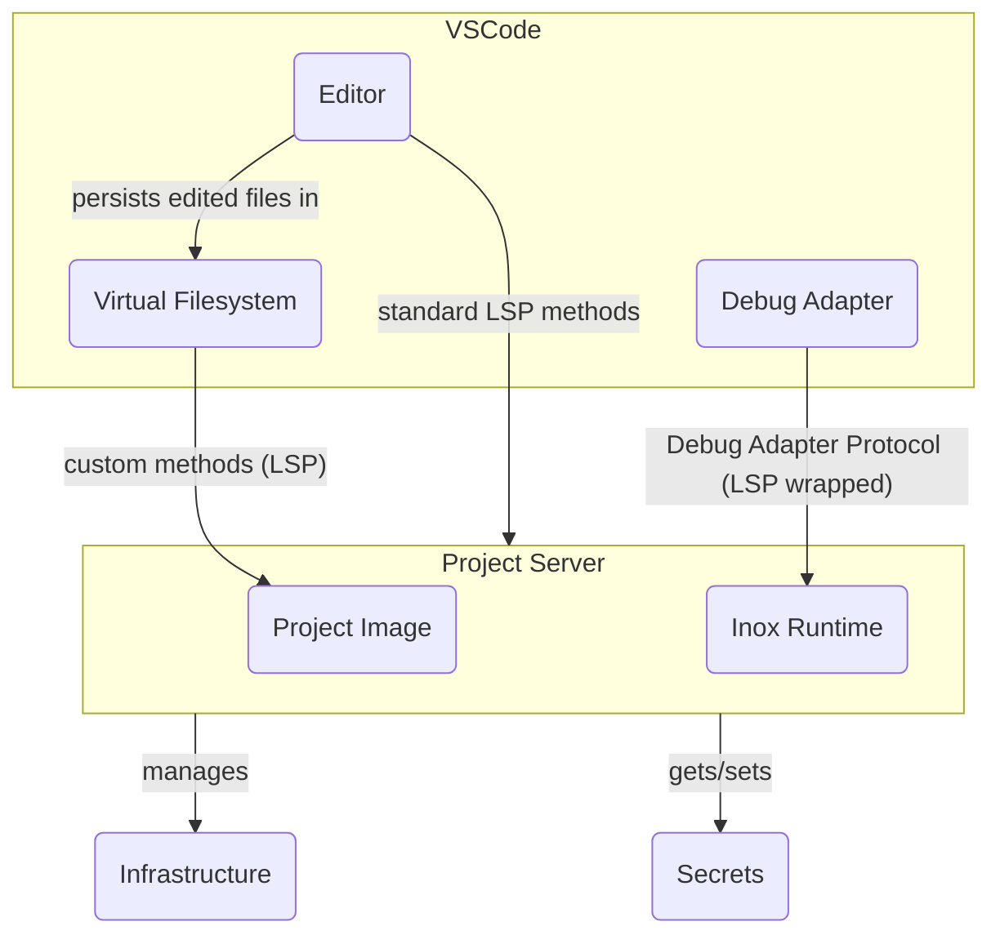
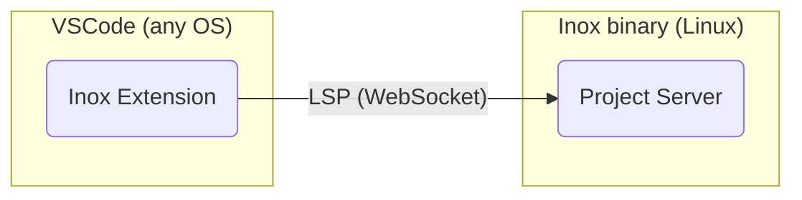

# Inox

</img>

Inox is  **single-binary platform** that will contain all you need to develop, test, and deploy web apps that are primarily rendered server-side. Applications are developped using **Inoxlang**, a sandboxed programming language that 
deeply integrates with several components: 
- A built-in database engine
- HTTP server
- Testing engine with in-memory filesystems (transparent for application code)
- An in-process container engine (unrelated to Linux containers).

**Important note: bear in mind that the current version of Inox is 0.2, not 1.0. The first stable versions of Inox won't support high-scalability applications.**

Here are a few example files that are part of a basic todo app.


**Database schema**


**A request handler (filesystem routing).** Each handler module runs in a dedicated execution context with its own permissions.


_Note: the permissions granted to imported modules (local or third-party) are **explicit**: `import lib ./malicious-lib.ix { allow: {} }`_

<details>

**<summary>⚙️ Another request handler (GET request with HTML rendering)</summary>**


</details>

<details>

**<summary>✅ Testing engine example</summary>**


</details>

---

**I have been working 2 years full time on Inox.**  There is still a lot to do in order to make Inox
usable in real world applications. If you believe this project has potential, **consider donating** through [GitHub](https://github.com/sponsors/GraphR00t) (preferred) or [Patreon](https://patreon.com/GraphR00t). It will help me continue working on Inox (check see **What is planned**). 

⬇️ [Installation](#installation)\
🔍 [Application Examples](#application-examples)\
📚 [Learning Inox](#learning-inox)\
👥 [Discord Server](https://discord.gg/53YGx8GzgE) & [Subreddit](https://www.reddit.com/r/inoxlang/)\
❔ [Questions you may have](#questions-you-may-have)

<details>

**<summary>🗓️ What is planned ?</summary>**

- Automated database backups in S3-compatible storage
- Log persistence in S3 (note that Inox has builtins for [structured logging](./docs/builtins.md#structured-logging)).
- Support automated deployments on popular cloud providers
- Storage of secrets in key management services (e.g. GCP KMS, AWS KMS). [Secrets](./docs/language-reference/secrets.md) are special Inox values that 
cannot be printed, logged or serialized.
- Develop a standard library
- Integrate a subset of Git (using https://github.com/go-git/go-billy and https://code.visualstudio.com/api/extension-guides/scm-provider)
- Support no-downtime upgrades
- **WebAssembly support** using https://github.com/tetratelabs/wazero
- Finish the transaction system and support persisting most data-structure types with accepable performance
- Team access control for Inox projects
- Improve execution performance and memory usage 
- Finalize the implementation of [structs](./docs/language-reference/transient-types.md#structs) and implement a [Low Level VM](https://github.com/inoxlang/inox/issues/32).
- Allow developers to define custom builtins written in Go (note: building inox is just `go build ./cmd/inox`)
- And more !

</details>


<details>

**<summary>🎯 Goals</summary>**

- Zero boilerplate
- Dead simple configuration
- Super stable (_once version 1.0 is reached_)
- Secure by default
- Low maintenance
- A programming language as simple as possible
- (Not in the near future) Support 100k+ requests per second (combined request throughput of several nodes).

</details>

<details>

**<summary>❌ Non Goals </summary>**

- Be a suitable solution for 100% of real-world web projects
- Support any database for storing domain data (`users`, ...)
  (however WebAssembly support is planned and will at least enable the use of SQLite and DuckDB).
- Be extremely fast
- Be very highly scalable (Multi-node support is planned though)

</details>

---

## Development Environment - Inox Project Server

The Inox binary comes with a **project server** that your IDE connects to. This server is a LSP server that implements custom methods. It enables the developer to develop, debug, test, deploy and manage secrets, all from VsCode. The project server will also provide automatic infrastructure management in the **near future**.

__Note that there is no local development environment.__ Code files are cached on the IDE for offline access (read only).

<details>

**<summary>⚙️ Diagram</summary>**



</details>


## Installation



Inox applications can currently only be developed using the Inox extension for VSCode and VSCodium.
You can install the inox binary on your local (Linux) machine, a local VM, or a remote machine.

<details>

**<summary>Local Installation</summary>**

- Download the latest release
  ```
  wget -N https://github.com/inoxlang/inox/releases/latest/download/inox-linux-amd64.tar.gz && tar -xvf inox-linux-amd64.tar.gz
  ```

- Install `inox` to `/usr/local/bin`
  ```
  sudo install ./inox -o root -m 0755 /usr/local/bin/inox
  ```

- Delete the files that are no longer needed
  ```
  rm ./inox inox-linux-amd64.tar.gz
  ```

<!-- - __\[recommended\]__ add the [inoxd daemon](./docs/inox-daemon.md) (systemd service) to automatically start the project server.
  If you have installed `inox` on your **local machine** or a local VM, you can execute the following command to add **inoxd**:
  ```
  sudo inox add-service # don't run this on a REMOTE machine
  ```
  _If you execute this command inside a VM, don't forget to forward the port 8305 to allow VSCode to connect to the project server._ -->

- Install the VSCode/VSCodium [extension](https://marketplace.visualstudio.com/items?itemName=graphr00t.inox). Make sure to read the **Requirements** and **Usage** sections in the extension's details.
</details>


<details>

**<summary>Installation on a remote machine (VPS)</summary>**

**This install is not recommended for now since there are potentially memory leaks.**

- Install the [Inox Daemon](https://github.com/inoxlang/inox/blob/main/docs/inox-daemon.md#on-a-vps---publicly-exposed-servers)

- Install the VSCode/VSCodium [extension](https://marketplace.visualstudio.com/items?itemName=graphr00t.inox). Make sure to read the **Requirements** and **Usage** sections in the extension's details.

</details>

If you have any questions you are welcome to join the [Discord Server](https://discord.gg/53YGx8GzgE) and the [Subreddit](https://www.reddit.com/r/inoxlang/).
If you want to build Inox from source go [here](#build-from-source).

## Application Examples

- [Basic Todo app with accounts and data persistence](./examples/apps/basic-todo)

_More examples will be added soon._

## Learning Inox

📖 [Language reference](docs/language-reference/language.md)\
📖 [HTTP Server reference](docs/http-server-reference.md)\
🌐 [Frontend dev](./docs/frontend-development.md)\
🧰 [Builtins](docs/builtins.md)\
📚 [Collections](docs/collections.md)

You can also learn the language directly in VSCode by creating a file with a `.tut.ix` extension.
**Make sure to create this file inside an Inox project.**


If you have any questions you are welcome to join the [Discord Server](https://discord.gg/53YGx8GzgE).

<details>
<summary>Scripting</summary>

Inox can be used for scripting & provides a shell. The development of the
language in those domains is not very active because Inox primarily focuses on
Web Application Development.

To learn scripting go [here](./docs/scripting-basics.md). View
[Shell Basics](./docs/shell-basics.md) to learn how to use Inox interactively.

</details>

## Build From Source

- Clone this repository
- `cd` into the directory
- Run `go build ./cmd/inox`


## Questions You May Have


<details>

**<summary>Why isn't Inox using a container runtime such as Docker ?</summary>**

Because the long term goal of Inox is to be a **simple**, single-binary and **super stable** platform for applications written in Inoxlang
and using libraries compiled to WASM.\
Each application or service will ultimately run in a separate process:
- filesystem isolation is achieved by using virtual filesystems (meta filesystem)
- process-level access control will be achieved using [Landlock](https://landlock.io/)
- fine-grained module-level access control is already achieved by Inox's permission system
- process-level resource allocation and limitation will be implemented using cgroups
- module-level resource allocation and limitation is performed by Inox's limit system

</details>

<details>


**<summary>Why have you created Inox ?</summary>**

Before reading the answser please make sure to read the **Goals & Non Goals sections**.

I like creating programming languages. At the beginning Inox was not even about full stack development.
It quickly evolved towards this use case because I am tired of accidental complexity in full stack development. I particularly hate having to 
glue and import components that are just needed 99% of the time. I don't like spending hours configuring stuff, a bit of 
configuration is fine though. Local development environments are also a pain to setup sometimes. (There is no true [local dev environment](#development-environment---inox-project-server) when developping Inox projects).

Inox being an opinionated **high-level** programming language / high level platform it obviously has pros and cons.
Also when using a new programming language you don't have access to a rich ecosystem. In other words Inox currently does not
bring all the potential value it could bring.

</details>


<details>

**<summary>What is the state of the codebase (quality, documentation, tests) ?</summary>**

As of now, certain parts of the codebase are not optimally written, lack sufficient comments and documentation, and do not have robust test coverage. 

</details>


## Early Sponsors

<table>
  <tr>
   <td align="center"><a href="https://github.com/Lexterl33t"><br />Lexter</a></td>
   <td align="center"><a href="https://github.com/datamixio"><br />Datamix.io</a></td>
  </tr>
</table>

Consider donating through [GitHub](https://github.com/sponsors/GraphR00t) (preferred) or [Patreon](https://patreon.com/GraphR00t). Thank you !

[Questions you may have](./QUESTIONS.md)\
[Installation](#installation)\
[Back To Top](#inox)
