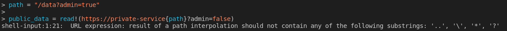
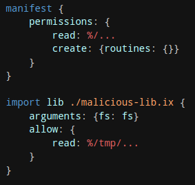
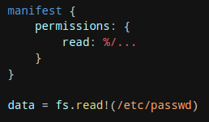
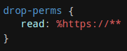

# Inox

</img>

🛡️ Inox is a programming language for writing secure scripts and web apps, it is dynamically typed and has optional type annotations.
It allows to easily write concurrent code and to exchange messages between objects.

# Installation

An archive with a Linux binary and some examples is available in [release assets](https://github.com/inoxlang/inox/releases), if you want to compile the language yourself go [here](#compile-from-source).

- uncompress the archive
- copy `startup.ix` into to your HOME directory and modify `/home/user` at the top to the path to your homedir.
- copy the `inox` binary to `/usr/local/bin`
  ```
  sudo cp inox /usr/local/bin/inox
  ```
- copy the `ide` folder where you want


To get started go [here](./docs/getting-started.md).\
⚠️ The language is not production ready yet.

# Features

## Injection Prevention

In Inox interpolations are always restricted in order to prevent injections.
When you dynamically create URLs the interpolations are restricted based on where the interpolation is located (path, query).\
</img>

Checked strings are strings that are validated against a pattern. When you dynamically
create a checked string all the interpolations must be explicitly typed.\
</img>


## Permission system

### Required permissions 

Inox features a granular permission system that restricts what a module is allowed to do, here is a few examples of permissions:
- access to the filesystem (read, create, update, write, delete)
- access to the network (several distinct permissions)
    - HTTP (read, create, update, delete, listen)
    - Websocket (read, write, listen)
    - DNS (read)
    - Raw TCP (read, write)
- access to environment variables (read, write, delete)
- create coroutines (multi threading)
- execute specific commands

Inox modules always start with a manifest that describes the required permissions.

</img>

When a forbidden operation is performed the module panics with an error:\
`core: error: not allowed, missing permission: [read path(s) /home/]`

### Isolation of dependencies

In imports the importing module specifies the permissions it grants to the imported module.

`./app.ix`

</img>

`./malicious-lib.ix`

</img>

If the imported module ask more permissions than granted are error is thrown:\
`import: some permissions in the imported module's manifest are not granted: [read path(s) /...] `

### Dropping permissions

Sometimes programs have an initialization phase, for example a program reads a file or performs an HTTP request to fetch its configuration.
After this phase it no longer needs some permissions so it can drop them.

</img>


## DoS mitigation

### Limitations (WIP)

Limitations limit the speed at which some actions are performed, the minimum required values/rates are specified in the manifest.
This feature is still in development and will be fully implemented soon.\
Limitations will for example allow the developer to restrict
the share of disk/network bandwitch allocated to a http request handler.

```
manifest {
    permissions: {
        ...
    }
    limits: {
        "fs/read": 10MB/s
        "http/req": 10x/s
    }
}
```

## Sensitive data protection (WIP)

TODO: explain

### Visibility (WIP)

TODO: explain

## Transactions & Effects (WIP)

TODO: explain

## Concurrency

### Coroutines (Goroutines)

```
coroutine = go {globals: .{print}} do {
  print("hello from goroutine !")
}

result = coroutine.wait_result!()
```

### Lifetime jobs

Lifetime jobs are coroutines linked to an object.

```
object = {
  lifetimejob #handle-events {
    for msg in watch_received_messages(self){
      # handle messages
    }
  }
}

```


## Object Communication

TODO: explain


## Compile from source

- clone this repository
- `cd` into the directory
- run `go build cmd/inox/inox.go`


