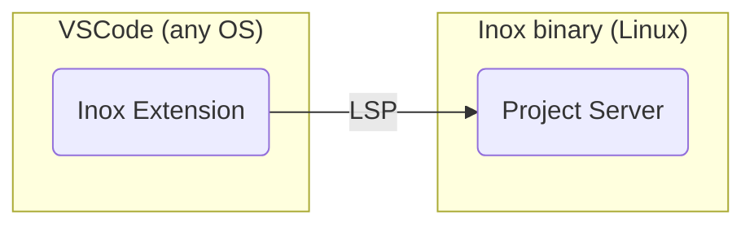
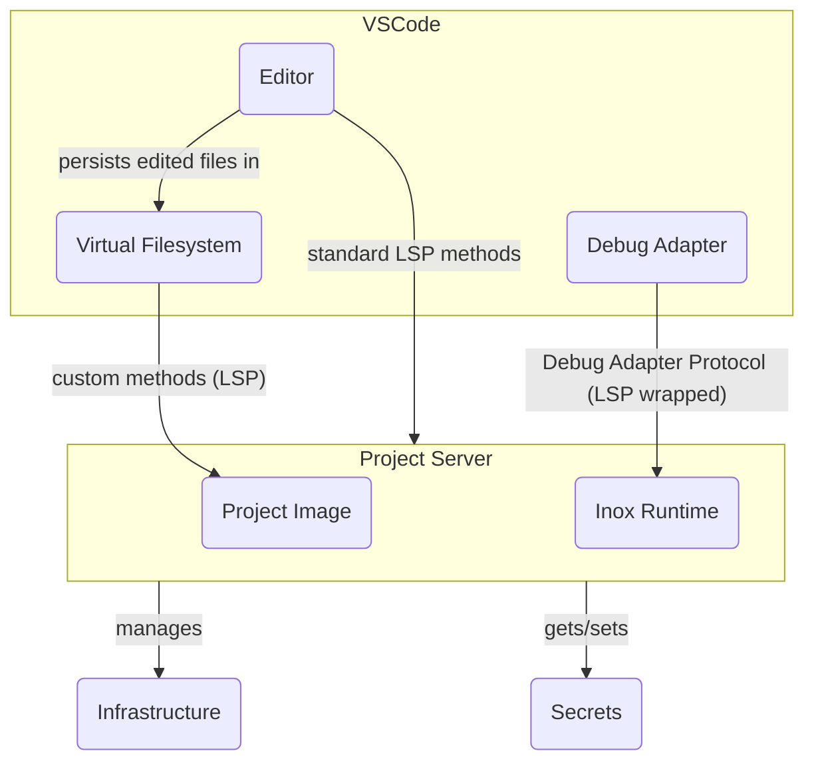
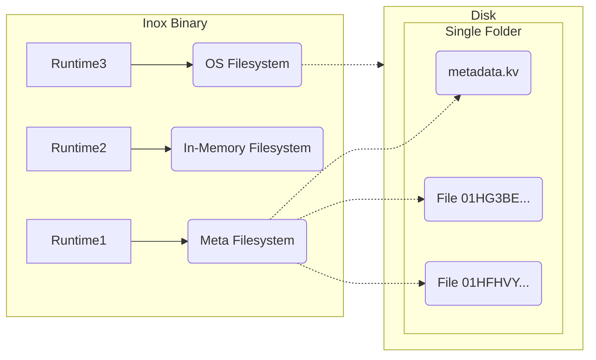

# Inox

</img>

🛡️ Inox is your **shield** against complexity in full-stack development.

The Inox platform is released as a **single binary** that will contain all you need to develop, test, and deploy web apps that are primarily rendered server-side. Applications are developped using **Inoxlang**, a sandboxed programming language that 
deeply integrates with Inox's built-in database engine, testing engine and HTTP server.

⚠️ Inox is not production-ready yet. Please consider donating through [GitHub](https://github.com/sponsors/GraphR00t) (preferred) or [Patreon](https://patreon.com/GraphR00t).

⬇️ [Installation](#installation)\
🔍 [Application Examples](#application-examples)\
📚 [Learning Inox](#learning-inox)\
👥 [Discord Server](https://discord.gg/53YGx8GzgE)

**Main Language & Development Features**

- [XML Expressions (HTML)](#xml-expressions)
- [HTTP Server - Filesystem Routing](#http-server---filesystem-routing)
- [Transactions & Effects (WIP)](#transactions--effects-wip)
- [Built-in Database](#built-in-database)
- [Project Server (LSP)](#project-server-lsp)
- [Virtual Filesystems](#virtual-filesystems)
- [Advanced Testing Engine](#advanced-testing-engine)
- [Structured Logging](#structured-logging)
- [Built-in Browser Automation](#built-in-browser-automation)

<details>

**<summary>🛡️ Security Features</summary>**
- [Permission system](#permission-system)
  - [Required permissions](#required-permissions)
  - [Isolation of dependencies](#isolation-of-dependencies)
  - [Process-Level Access Control](#process-level-access-control)
  - [Dropping permissions](#dropping-permissions)
- [DoS Mitigation (WIP)](#dos-mitigation)
- [Sensitive Data Protection](#sensitive-data-protection)
  - [Secrets](#secrets)
  - [Visibility during Serialization](#visibility-wip)
- [Injection Prevention](#injection-prevention-wip)

</details>

<details>

**<summary>⭐ Other Language Features</summary>**
- [Concurrency](#concurrency)
  - [Lightweight Threads](#lightweight-threads)
  - [LThread Groups](#lthread-groups)
- [Context Data](#context-data)
- [Readable String Patterns](#readable-string-patterns)
- [Many Built-in Functions](#built-in-functions)
- [Easy declaration of CLI Parameters](#declaration-of-cli-parameters--environment-variables)

</details>

<details>

**<summary>🚧 Planned Features</summary>**
- CSS and JS Bundling
- Encryption of secrets and database data
- Storage of secrets in key management services (e.g. GCP KMS, AWS KMS)
- Version Control System (Git) for projects using https://github.com/go-git/go-git 
- Database backup in S3 (compatible) storage
- Database with persistence in S3 and on-disk cache
- Log persistence in S3
- WebAssembly support using https://github.com/tetratelabs/wazero.
- Team management and access control
- ... [other planned features](./FUTURE.md)

</details>

<details>

**<summary>🎯 Goals</summary>**

- Zero boilerplate
- Dead simple configuration
- Super stable (_once version 1.0 is reached_)
- No rabbit holes
- Secure by default
- Low maintenance
- A programming language as simple as possible


</details>


❔ [Questions you may have](./QUESTIONS.md)

---

## Installation



Inox applications can currently only be developed using the Inox extension for VSCode and VSCodium.
You can install the inox binary on your local (Linux) machine, local VM, or a remote machine.

<details>

**<summary>Installation Instructions</summary>**

- Download the latest release
  ```
  wget -N https://github.com/inoxlang/inox/releases/latest/download/inox-linux-amd64.tar.gz && tar -xvf inox-linux-amd64.tar.gz
  ```

- Install `inox` to `/usr/local/bin`
  ```
  sudo install ./inox -o root -m 0755 /usr/local/bin/inox
  ```

- Delete the files that are no longer needed
  ```
  rm ./inox inox-linux-amd64.tar.gz
  ```

<!-- - __\[recommended\]__ add the [inoxd daemon](./docs/inox-daemon.md) (systemd service) to automatically start the project server.
  If you have installed `inox` on your **local machine** or a local VM, you can execute the following command to add **inoxd**:
  ```
  sudo inox add-service # don't run this on a REMOTE machine
  ```
  _If you execute this command inside a VM, don't forget to forward the port 8305 to allow VSCode to connect to the project server._ -->

- __Add Inox support to your IDE__
  - [VSCode & VSCodium](https://marketplace.visualstudio.com/items?itemName=graphr00t.inox) : LSP, debug, colorization, snippets, formatting.\
    **⚠️ Once the extension is installed make sure to read the Requirements and Usage sections in the extension's details.**

- __\[optional\]__ install command completions for the current user
  ```
  inox install-completions
  ```

</details>

If you want to build Inox from source go [here](#build-from-source).

## Application Examples

- [Basic Todo app](./examples/apps/basic-todo-app.md)

_More examples will be added soon._

## Learning Inox

You can learn Inox directly in VSCode by creating a file with a `.tut.ix` extension. This is the recommended way.
**Make sure to create this file inside an Inox project.**


📖 [Language reference](docs/language-reference/language.md)\
📖 [HTTP Server reference](docs/http-server-reference.md)\
🌐 [Frontend dev](./docs/frontend-development.md)\
🧰 [Builtins](docs/builtins.md)\
📚 [Collections](docs/collections.md)

If you have any questions you are welcome to join the [Discord Server](https://discord.gg/53YGx8GzgE).

<details>
<summary>Scripting</summary>

Inox can be used for scripting & provides a shell. The development of the
language in those domains is not very active because Inox primarily focuses on
Web Application Development.

To learn scripting go [here](./docs/scripting-basics.md). View
[Shell Basics](./docs/shell-basics.md) to learn how to use Inox interactively.

</details>

## Features

### XML expressions

HTML elements can be created without imports using the built-in **html**
namespace and a JSX-like syntax:

```
manifest {}

element = html<div> Hello world ! </div>
```

### HTTP Server - Filesystem Routing

Inox comes with a built-in HTTP server that supports filesystem routing:

```
# main.ix
const (
    HOST = https://localhost:8080
)

manifest {
    permissions: {
        provide: HOST
        read: %/...
    }
}

server = http.Server!(HOST, {
    routing: {
        static: /static/
        dynamic: /routes/
    }
})
```

For maximum security, each request is processed in an isolated module:

```
# /routes/users/POST.ix

manifest {
    parameters: {
        # JSON body parameter
        name: {
            pattern: %str
        }
    }
    permissions: {
        create: %https://internal-service/users/...
    }
}

username = mod-args.name
...
```

> Note: The default [Content Security Policy](./docs/builtins.md#httpcsp) returned by the HTTP server (header) is very strict by default. 

> GET/HEAD requests cannot cause changes in the filesystem or in databases.

### Transactions & Effects (WIP)

Inox allows you to attach a **transaction** to the current execution context.

This feature is always used when handling **HTTP requests**. For each request, a transaction is created by the server. Effects such as database changes are only applied when the transaction is committed.

<details>

**<summary>Manual transaction creation (WIP)</summary>**
```
tx = start_tx()

# effect
fs.mkfile ./file.txt 

# rollback transaction --> delete ./file.txt
cancel_exec()
```
</details>


⚠️ I am still working on this feature. For now most effects on databases and some on the filesystem are implemented.
Filesystem changes are reversed if the transaction is rolled back, but I intend to add real transaction
support (applying changes on commit) at least for the in-processs virtual filesystems.

### Built-in Database

Inox includes an embedded database engine. Databases are described in the manifest at the top of the module:

```
manifest {
    permissions: {}
    databases: {
        main: {
            # ldb stands for Local Database
            resource: ldb://main  
            resolution-data: nil
            expected-schema-update: true
        }
    }
}

# define the pattern for user data
pattern user = {
  name: str
}

dbs.main.update_schema(%{
    users: Set(user, #url)
}, {
    inclusions: :{
        %/users: []
    }
})

# Objects inside the database are accessed like any other Inox objects.
users = dbs.main.users
```

<details>
  
**<summary>Schema update demo</summary>**


</details>

Objects can be directly added to and retrieved from the database.\
This is enabled by the fact that most Inox types are constrained to be
serializable.

<details>

**<summary>Details about serializability</summary>**

Most Inox types (objects, lists, Sets) are serializable so they cannot contain
transient values.

```
object = {
  # error: non-serializable values are not allowed as initial values of properties
  lthread: go do {
    return 1
  }
}

# same error
list = [  
  go do { return 1 }
]
```

The transient counterparts of objects are
[structs](./docs/language-reference/language.md#structs) (not implemented yet).

```
struct Task {
  name: str
}

task1 = Task{name: "0"}
task2 = Task{name: "1"}

array = Array(task1, task2)
```

You can learn more about serialization [here](./docs/language-reference/language.md#serialization).

</details>

```
new_user = {name: "John"}
dbs.main.users.add(new_user)

# true
dbs.main.users.has(new_user)
```

You can learn more about databases [here](./docs/language-reference/language.md#databases).

> The database currently uses a single-file key-value store and the serialization of most container types is not yet implemented.
> The improvement of the database engine is a main focus point. The goal is to have a DB engine that is aware of the code accessing it (HTTP request handlers) in order to smartly pre-fetch and cache data.

### Project Server (LSP)

The Inox binary comes with a **project server** that your IDE connects to. This server is a LSP server that implements custom methods. It enables the developer to develop, debug, test, deploy and manage secrets, all from VsCode. The project server will also provide automatic infrastructure management in the **near future**.

__Note that there is no local development environment.__ Code files are cached on the IDE for offline access (read-only).

<details>

**<summary>⚙️ Diagram</summary>**



</details>

In project mode Inox applications are executed inside a **virtual filesystem** (container) for better
security & reproducibility. Note that this virtual filesystem only exists
in-process, there is no FUSE filesystem and Docker is not used.

**How can I execute binaries if the filesystem only exists inside a process ?**\
You can't, but executing programs compiled to WebAssembly will be soon possible.

[Why isn't Inox using a container runtime such as Docker ?](./QUESTIONS.md)

### Virtual Filesystems

In project mode Inox applications run inside a **meta filesystem** that persists data on disk.
Files in this filesystem are regular files, (most) metadata and directory structure are stored in a single file named `metadata.kv`.
It's impossible for applications running inside this filesystem to access an arbitrary file on the disk.

<details>

**<summary>Diagram</summary>**



</details>


### Advanced Testing Engine

**Virtual filesystems**:

```
manifest {}

snapshot = fs.new_snapshot{
    files: :{
        ./file1.txt: "content 1"
        ./dir/: :{
            ./file2.txt: "content 2"
        }
    }
}

testsuite ({
    # a filesystem will be created from the snapshot 
    # for each nested suite and test case.
    fs: snapshot
}) {

    assert fs.exists(/file1.txt)
    fs.rm(/file1.txt)

    testcase {
        # no error
        assert fs.exists(/file1.txt)
        fs.rm(/file1.txt)
    }

    testcase {
        # no error
        assert fs.exists(/file1.txt)
    }
}
```

Inox's testing engine supports executing Inox programs. It automatically creates
a short-lived filesystem from the project's base image.

```
manifest {
    permissions: {
        provide: https://localhost:8080
    }
}

testsuite({
    program: /web-app.ix
}) {
    testcase {
        assert http.exists(https://localhost:8080/)
    }

    testcase {
        assert http.exists(https://localhost:8080/about)
    }
}
```

[Learn More About Testing](./docs/language-reference/language.md#testing)

### Structured Logging


[Documentation](./docs/builtins.md#structured-logging)

### Built-in Browser Automation

```
h = chrome.Handle!()

h.nav https://go.dev/
node = h.html_node!(".Hero-blurb")
h.close()
```

[Documentation](https://github.com/inoxlang/inox/blob/main/docs/builtins.md#browser-automation)

[Examples](https://github.com/inoxlang/inox/tree/main/examples/chrome)


> Browser automation is quite buggy right now, I need to improve the configuration of https://github.com/chromedp/chromedp.

---

[Skip security feature sections](#concurrency)

### Permission System

#### **Required Permissions**

Inox features a fine-grained **permission system** that restricts what a module
is allowed to do (e.g. access to the filesystem, network). Inox modules always start with a **manifest** that describes the required
permissions.


<details>

**<summary>Permission examples</summary>**

- Access to the filesystem (read, create, update, write, delete)
- Access to the network (several distinct permissions)
  - HTTP (read, create, update, delete, listen)
  - Websocket (read, write, listen)
  - DNS (read)
  - Raw TCP (read, write)
- Access to environment variables (read, write, delete)
- Create lightweight threads
- Cxecute specific commands

</details>

</img>

<!-- code that appear on the image
manifest {
  permissions: {
    read: %/tmp/...
  }
}

malicious_user_input = /home/
....
print(fs.ls!(malicious_user_input))

-->

Attempting to perform a forbidden operation raises an error:\
`core: error: not allowed, missing permission: [read path(s) /home/]`

#### **Isolation of Dependencies**

Permissions granted to the imported modules are specified in the import statements.

`./app.ix`

```
manifest {
  permissions: {
    read: %/...
    create: {threads: {}}
  }
}

import lib ./malicious-lib.ix {
  arguments: {}
  allow: {
    read: %/tmp/...
  }
}
```

<details>

**<summary>./malicious-lib.ix</summary>**

```
manifest {
  permissions: {
    read: %/...
  }
}

data = fs.read!(/etc/passwd)
```
</details>


If the imported module asks more permissions than granted an error is thrown:\
`import: some permissions in the imported module's manifest are not granted: [read path(s) /...]`

#### **Process-Level Access Control**

In addition to the checks performed by the permission system, the **inox**
binary uses [Landlock](https://landlock.io/) to restrict file access for the
whole process and its children.

#### **Dropping Permissions**

Sometimes programs have an **initialization** phase, for example a program reads
a file or performs an HTTP request to fetch its configuration. After this phase
it no longer needs some permissions so it can drop them.

```
drop-perms {
  read: %https://**
}
```

### DoS Mitigation

#### **Limits (WIP)**

Limits limit intensive operations, there are three kinds of limits: **byte rate**, **frequency** & **total**. They are defined in the manifest and are
[shared](./docs/language-reference/language.md#limits) with the children of the module.

```
manifest {
    permissions: {
        ...
    }
    limits: {
        "fs/read": 10MB/s
        "http/req": 10x/s
    }
}
```

By default strict limits are applied on HTTP request handlers in order to
mitigate some types of DoS.

[Learn More](./docs/language-reference/language.md#limits)

### Sensitive Data Protection

#### **Secrets**

Secrets are special Inox values, they can only be created by defining an
**environment variable** with a pattern like %secret-string or by storing a
[project secret](./docs/project.md#project-secrets).

- The content of the secret is **hidden** when printed or logged.
- Secrets are not serializable so they cannot be included in HTTP responses.
- A comparison involving a secret always returns **false**.

```
manifest {
    ...
    env: %{
        API_KEY: %secret-string
    }
    ...
}

API_KEY = env.initial.API_KEY
```

<details>

**<summary>Demo of project secrets</summary>**


</details>


#### **Visibility (WIP)**

_This feature is **very much** work in progress._

[**Excessive Data Exposure**](https://apisecurity.io/encyclopedia/content/owasp/api3-excessive-data-exposure.htm)
occurs when an HTTP API returns more data than needed, potentially exposing sensitive information. In order to mitigate this type of vunerability the serialization of Inox values involves the concepts of **value visibility** and **property visibility**.

<details>

**<summary>Example</summary>**

Here is an Inox object:

```
{
  non_sensitive: 1, 
  x: EmailAddress"example@mail.com"
  age: 30, 
  password-hash: "x"
}
```

The serialization of the object will not include properties having a **sensitive
name** or a **sensitive value**:

```
{
  "non_sensitive": 1
}
```

The visibility of properties can be configured using the `_visibility_`
metaproperty.

```
{
  _visibility_ {
    {
      public: .{password-hash}
    }
  }
  password-hash: "x"
}
```

ℹ️ In the near future the visibility will be configurable directly in patterns &
database schemas. Also the detection of properties with a 'sensitive name' will
rely on the developer following **standard naming conventions** that I will document
in the future.

</details>

### Injection Prevention (WIP)

In Inox interpolations are always restricted in order to prevent **injections**
and regular strings are **never trusted**. URLs & paths are first-class values
and must be used to perform network or filesystem operations.


#### Path Interpolations

```
filepath = ./go
/home/user/{filepath} # /home/user/go

filepath = ../../etc/shadow # malicious user input
/home/user/{filepath} 
# error: result of a path interpolation should not contain any of the following substrings: '..', '\', '*', '?'
```

> Allowing specific dangerous substrings may be supported in the future.

#### **URL Interpolations**

URL interpolations are restricted based on their location (path, query).

```
https://example.com/{path}?a={param}
```

In short, most malicious `path` and `param` values provided by a malevolent user
will cause an error at runtime.

<details>
<summary>
 Click for more explanations.
</summary>

Let's say that you are writing a piece of code that fetches **public** data from
a private/internal service and returns the result to a user. You are using the
query parameter `?admin=false` in the URL because only public data should be
returned.

```
public_data = http.read!(https://private-service{path}?admin=false)
```

The way in which the user interacts with your code is not important here, let's
assume that the user can send any value for `path`. Obviously this is a very bad
idea from a security standpoint. A malicious path could be used to:

- perform a directory traversal if the private service has a vulnerable endpoint
- inject a query parameter `?admin=true` to retrieve private data
- inject a port number

In Inox the URL interpolations are special, based on the location of the
interpolation specific checks are performed:

```
https://example.com/api/{path}/?x={x}
```

- interpolations before the `'?'` are **path** interpolations
  - the strings/characters `'..'`, `'\\'`, `'?'` and `'#'` are forbidden
  - the URL encoded versions of `'..'` and `'\\'` are forbidden
  - `':'` is forbidden at the start of the finalized path (after all
    interpolations have been evaluated)
- interpolations after the `'?'` are **query** interpolations
  - the characters `'&'` and `'#'` are forbidden

In the example if the path `/data?admin=true` is received the Inox runtime will
throw an error:

```
URL expression: result of a path interpolation should not contain any of the following substrings: "..", "\" , "*", "?"
```

</details>

---

### Concurrency

#### **Lightweight threads**

```
lthread = go {} do {
  print("hello from lightweight thread !")
  return 1
}

# 1
result = lthread.wait_result!()
```

#### **Lthread Groups**

```
group = LThreadGroup()
lthread1 = go {group: group} do read!(https://jsonplaceholder.typicode.com/posts/1)
lthread2 = go {group: group} do read!(https://jsonplaceholder.typicode.com/posts/2)

results = group.wait_results!()
```

### Context Data

The [context](docs/language-reference/context.md) of module instances can contain data entries that can be set **only once**.
Child modules have access to the context data of their parent and can individually override entries.

```
add_ctx_data(/lang, "en-US")

...

fn print_error(){
  lang = ctx_data(/lang)
  ...
}
```

The HTTP server adds a `/session` entry to the handling context of a request if the `session-id` cookie is present.


### Readable String Patterns

Here is the regex for a made up identifier type:
`(?<name>[a-z]+)#(?<numA>\d+)-(?<letters>[a-z]+)-(?<numB>\d+)`

Same RegExp without group names:
`([a-z]+)#(\d+)-([a-z]+)-(\d+)`

Inox's version:


String patterns can also be composed:


<details>

**<summary>Recursive string patterns (WIP)</summary>**

```
pattern json-list = @ %str( 
    '[' 
        (| atomic-json-val
         | json-val 
         | ((json-val ',')* json-val) 
        )? 
    ']'
)

pattern json-val = @ %str(| json-list | atomic-json-val)
pattern atomic-json-val = "1"
```

⚠️ Recursive string patterns are not intended to be used for validating or parsing large inputs.

</details>


### Built-in Functions

Inox comes with many built-in functions for:

- Browser automation
- File manipulation
- HTTP resource manipulation
- Structured logging
- Data container constructors (Graph, Tree, ...)

**[List of Built-in Functions](./docs/builtins.md)**

### Declaration of CLI Parameters & Environment Variables

CLI parameters & environment variables can be described in the manifest:

```
manifest {
    parameters: {
        # positional parameters are listed at the start
        {
            name: #dir
            pattern: %path
            rest: false
            description: "root directory of the project"
        }
        # non positional parameters
        clean-existing: {
            pattern: %bool
            default: false
            description: "if true delete <dir> if it already exists"
        }
    }
    env: {
      API_KEY: %secret-string
    }

    permissions: {
        write: IWD_PREFIX # initial working directory
        delete: IWD_PREFIX
    }
}

# {
#   "dir": ...
#   "clean-existing": ...
# }
args = mod-args

API_KEY = env.initial.API_KEY
```

<details>

**<summary>Help message generation</summary>**

```
$ inox run test.ix 
not enough CLI arguments
usage: <dir path> [--clean-existing]

required:

  dir: %path
      root directory of the project

options:

  clean-existing (--clean-existing): boolean
      if true delete <dir> if it already exists
```
</details>


## Build From Source

- Clone this repository
- `cd` into the directory
- Run `go build ./cmd/inox`

## Early Sponsors

<table>
  <tr>
   <td align="center"><a href="https://github.com/Lexterl33t"><br />Lexter</a></td>
   <td align="center"><a href="https://github.com/datamixio"><br />Datamix.io</a></td>
  </tr>
</table>

I am working full-time on Inox, please consider donating through [GitHub](https://github.com/sponsors/GraphR00t) (preferred) or [Patreon](https://patreon.com/GraphR00t).

[Questions you may have](./QUESTIONS.md)\
[Customization Model](./CUSTOMIZATION.md)\
[Installation](#installation)\
[Back To Top](#inox)
