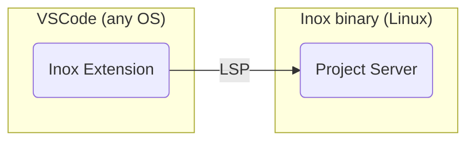

# Inox

</img>

🛡️ Inox is your **shield** against complexity in full-stack development.

The Inox platform is released as a **single binary** that will contain all you need to develop, test, and deploy web apps that are primarily rendered server-side. Applications are developped using **Inoxlang**, a sandboxed programming language that 
deeply integrates with Inox's built-in database engine, testing engine and HTTP server.

**The first stable versions of Inox won't support high scalability applications**

Please consider donating through [GitHub](https://github.com/sponsors/GraphR00t) (preferred) or [Patreon](https://patreon.com/GraphR00t).

⬇️ [Installation](#installation)\
🔍 [Application Examples](#application-examples)\
📚 [Learning Inox](#learning-inox)\
👥 [Discord Server](https://discord.gg/53YGx8GzgE)\
❔ [Questions you may have](#questions-you-may-have)


_Note: the permissions granted to imported modules (local or third-party) are **explicit**: `ìmport lib ./malicious-lib.ix { allow: {} }`_


<details>

**<summary>🎯 Goals</summary>**

- Zero boilerplate
- Dead simple configuration
- Super stable (_once version 1.0 is reached_)
- Secure by default
- Low maintenance
- A programming language as simple as possible
- (Not in the near future) Support 100k+ requests per second (combined request throughput of several nodes).

</details>

<details>

**<summary>❌ Non-Goals (for now) </summary>**

- Be _blazingly_ fast
- Be planet scale
- Be a suitable solution for 100% of real-world web projects
- Support other databases for storing domain data (`users`, ...)
  (however Wasm support is planned and will enable the use of SQLite and DuckDB).

</details>


**I have been working 2 years full time on Inox.** There is a **lot** of remaining work to do in order to make Inox
usable in real world applications. If you consider this project to have some potential: consider donating through [GitHub](https://github.com/sponsors/GraphR00t) (preferred) or [Patreon](https://patreon.com/GraphR00t), to allow me to continue my work on the project. Thank you :)

What is planned ?

- Finish the transaction system and support persisting most data-structure types
- Automated database backups in S3-compatible storage
- Log persistence in S3 (note that Inox has builtins for [structured logging](./docs/builtins.md#structured-logging)).
- Support automated deployments on popular cloud providers
- Storage of secrets in key management services (e.g. GCP KMS, AWS KMS). [Secrets](./docs/language-reference/secrets.md) are special Inox values that 
cannot be printed, logged or serialized.
- Improve execution performance and memory usage
- Develop a standard library
- Integrate a subset of Git (using https://github.com/go-git/go-billy and https://code.visualstudio.com/api/extension-guides/scm-provider)
- Support no-downtime upgrades
- WebAssembly support using https://github.com/tetratelabs/wazero
- Team access control for Inox projects
- And more !

## Questions You May Have

<details>

**<summary>Why isn't Inox using a container runtime such as Docker ?</summary>**

Because the long term goal of Inox is to be a **simple**, single-binary and **super stable** platform for applications written in Inoxlang
and using libraries compiled to WASM.\
Each application or service will ultimately run in a separate process:
- filesystem isolation is achieved by using virtual filesystems (meta filesystem)
- process-level access control will be achieved using [Landlock](https://landlock.io/)
- fine-grained module-level access control is already achieved by Inox's permission system
- process-level resource allocation and limitation will be implemented using cgroups
- module-level resource allocation and limitation is performed by Inox's limit system

</details>

<details>

**<summary>What is the state of the codebase (quality, documentation, tests) ?</summary>**

As of now, certain parts of the codebase are not optimally written, lack sufficient comments and documentation, and do not have robust test coverage. The first version (0.1) being now released, I will dedicate 20-30% of my working time to improving the overall quality, documentation, and test coverage of the codebase.

</details>

---

## Installation



Inox applications can currently only be developed using the Inox extension for VSCode and VSCodium.
You can install the inox binary on your local (Linux) machine, local VM, or a remote machine.

<details>

**<summary>Installation Instructions</summary>**

- Download the latest release
  ```
  wget -N https://github.com/inoxlang/inox/releases/latest/download/inox-linux-amd64.tar.gz && tar -xvf inox-linux-amd64.tar.gz
  ```

- Install `inox` to `/usr/local/bin`
  ```
  sudo install ./inox -o root -m 0755 /usr/local/bin/inox
  ```

- Delete the files that are no longer needed
  ```
  rm ./inox inox-linux-amd64.tar.gz
  ```

<!-- - __\[recommended\]__ add the [inoxd daemon](./docs/inox-daemon.md) (systemd service) to automatically start the project server.
  If you have installed `inox` on your **local machine** or a local VM, you can execute the following command to add **inoxd**:
  ```
  sudo inox add-service # don't run this on a REMOTE machine
  ```
  _If you execute this command inside a VM, don't forget to forward the port 8305 to allow VSCode to connect to the project server._ -->

- __Add Inox support to your IDE__
  - [VSCode & VSCodium](https://marketplace.visualstudio.com/items?itemName=graphr00t.inox) : LSP, debug, colorization, snippets, formatting.\
    **⚠️ Once the extension is installed make sure to read the Requirements and Usage sections in the extension's details.**

- __\[optional\]__ install command completions for the current user
  ```
  inox install-completions
  ```

</details>

If you want to build Inox from source go [here](#build-from-source).

## Application Examples

- [Basic Todo app](./examples/apps/basic-todo-app.md)

_More examples will be added soon._

## Learning Inox

You can learn Inox directly in VSCode by creating a file with a `.tut.ix` extension. This is the recommended way.
**Make sure to create this file inside an Inox project.**


📖 [Language reference](docs/language-reference/language.md)\
📖 [HTTP Server reference](docs/http-server-reference.md)\
🌐 [Frontend dev](./docs/frontend-development.md)\
🧰 [Builtins](docs/builtins.md)\
📚 [Collections](docs/collections.md)

If you have any questions you are welcome to join the [Discord Server](https://discord.gg/53YGx8GzgE).

<details>
<summary>Scripting</summary>

Inox can be used for scripting & provides a shell. The development of the
language in those domains is not very active because Inox primarily focuses on
Web Application Development.

To learn scripting go [here](./docs/scripting-basics.md). View
[Shell Basics](./docs/shell-basics.md) to learn how to use Inox interactively.

</details>

## Build From Source

- Clone this repository
- `cd` into the directory
- Run `go build ./cmd/inox`

## Early Sponsors

<table>
  <tr>
   <td align="center"><a href="https://github.com/Lexterl33t"><br />Lexter</a></td>
   <td align="center"><a href="https://github.com/datamixio"><br />Datamix.io</a></td>
  </tr>
</table>

I am working full-time on Inox, please consider donating through [GitHub](https://github.com/sponsors/GraphR00t) (preferred) or [Patreon](https://patreon.com/GraphR00t).

[Questions you may have](./QUESTIONS.md)\
[Installation](#installation)\
[Back To Top](#inox)
