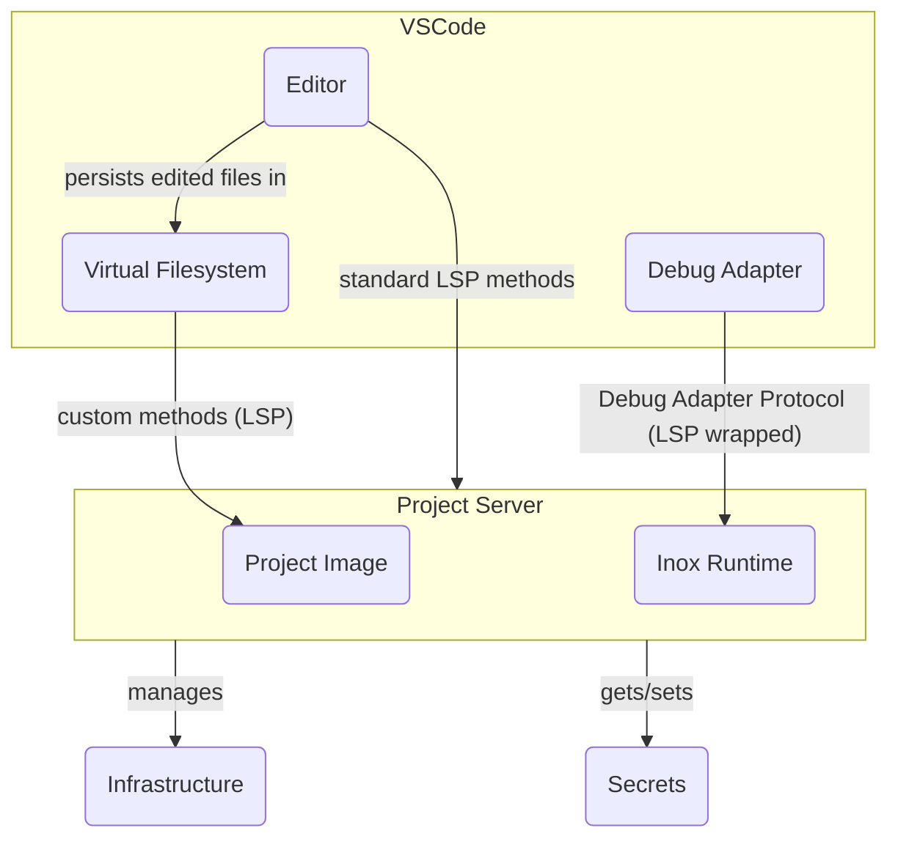
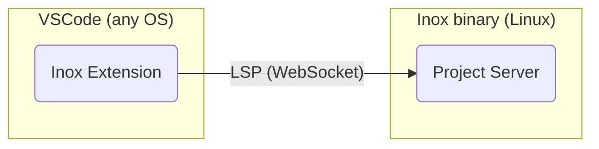
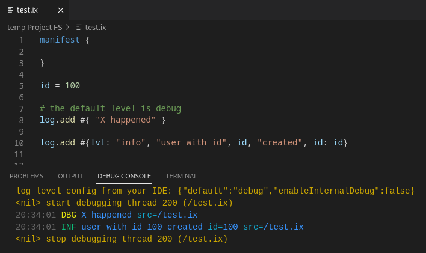

# Inox

</img>

Inox is a **single-binary platform** that will contain all you need to develop,
test, and deploy web apps that are primarily rendered server-side. Applications
are developped using **Inoxlang**, a sandboxed programming language that deeply
integrates with several components:

- A built-in database engine
- HTTP server with filesystem routing
- Testing engine supporting virtual filesystems and temporary databases
  (completely transparent for application code).
- An in-process container engine: each application runs in a dedicated virtual
  filesystem, and is subject to permissions (unrelated to Linux containers).

**Even though you can already develop web apps using Inox, keep in mind that the
current version of Inox is 0.2, not 1.0. Also the first stable versions of Inox
won't support high-scalability applications.**

Here are a few example files that are part of a basic todo app.


**Database schema**


**A request handler (filesystem routing).** Each handler module runs in a
dedicated execution context with its own permissions.


_Note: the permissions granted to imported modules (local or third-party) are
**explicit**: `import lib ./malicious-lib.ix { allow: {} }`_

<details>

**<summary>⚙️ Another request handler (GET request with HTML
rendering)</summary>**


</details>

<details>

**<summary>✅ Testing engine example</summary>**


</details>

---

**I have been working 2 years full time on Inox.** There is still a lot to do in
order to make Inox usable in real world applications. If you believe this
project has potential, **consider donating** through
[GitHub](https://github.com/sponsors/GraphR00t) (preferred) or
[Patreon](https://patreon.com/GraphR00t). It will help me continue working on
Inox (check see 'What is planned' and [Other features](#other-features)).

⬇️ [Installation](#installation)\
🔍 [Application Examples](#application-examples)\
📚 [Learning Inox](#learning-inox)\
⭐ [Other features](#other-features)\
👥 [Discord Server](https://discord.gg/53YGx8GzgE) &
[Subreddit](https://www.reddit.com/r/inoxlang/)\
❔ [Questions you may have](#questions-you-may-have)

<details>

**<summary>🗓️ What is planned ?</summary>**

- Automated database backups in S3-compatible storage
- Log persistence in S3 (note that Inox has builtins for
  [structured logging](#structured-logging).
- Support automated deployments on popular cloud providers
- Storage of secrets in key management services (e.g. GCP KMS, AWS KMS).
  [Secrets](./docs/language-reference/secrets.md) are special Inox values that
  cannot be printed, logged or serialized.
- Develop a standard library
- Integrate a subset of Git (using https://github.com/go-git/go-git and
  https://code.visualstudio.com/api/extension-guides/scm-provider)
- Support no-downtime upgrades
- **WebAssembly support** using https://github.com/tetratelabs/wazero
- Finish the transaction system and support persisting most data-structure types
  with accepable performance
- Team access control for Inox projects
- Improve execution performance and memory usage
- Finalize the implementation of
  [structs](./docs/language-reference/transient-types.md#structs) and implement
  a [Low Level VM](https://github.com/inoxlang/inox/issues/32).
- Allow developers to define custom builtins written in Go (note: building inox
  is just `go build ./cmd/inox`)
- And more !

</details>

<details>

**<summary>🎯 Goals</summary>**

- Zero boilerplate
- Dead simple configuration
- Super stable (_once version 1.0 is reached_)
- Secure by default
- Low maintenance
- A programming language as simple as possible
- (Not in the near future) Support 100k+ requests per second (combined request
  throughput of several nodes).

</details>

<details>

**<summary>❌ Non Goals </summary>**

- Be a suitable solution for 100% of real-world web projects
- Support any database for storing domain data (`users`, ...) (however
  WebAssembly support is planned and will at least enable the use of SQLite and
  DuckDB).
- Be extremely fast
- Be very highly scalable (Multi-node support is planned though)

</details>

---

## Development Environment - Inox Project Server

The Inox binary comes with a **project server** that your IDE connects to. This
server is a LSP server that implements custom methods. It enables the developer
to develop, debug, test, deploy and manage secrets, all from VsCode. The project
server will also provide automatic infrastructure management in the **near
future**.

**Note that there is no local development environment.** Code files are cached
on the IDE for offline access (read only).

<details>

**<summary>⚙️ Diagram</summary>**



</details>

## Installation



Inox applications can currently only be developed using the Inox extension for
VSCode and VSCodium. You can install the inox binary on your local (Linux)
machine, a local VM, or a remote machine.

<details>

**<summary>Local Installation</summary>**

- Download the latest release
  ```
  wget -N https://github.com/inoxlang/inox/releases/latest/download/inox-linux-amd64.tar.gz && tar -xvf inox-linux-amd64.tar.gz
  ```

- Install `inox` to `/usr/local/bin`
  ```
  sudo install ./inox -o root -m 0755 /usr/local/bin/inox
  ```

- Delete the files that are no longer needed
  ```
  rm ./inox inox-linux-amd64.tar.gz
  ```

<!-- - __\[recommended\]__ add the [inoxd daemon](./docs/inox-daemon.md) (systemd service) to automatically start the project server.
  If you have installed `inox` on your **local machine** or a local VM, you can execute the following command to add **inoxd**:
  ```
  sudo inox add-service # don't run this on a REMOTE machine
  ```
  _If you execute this command inside a VM, don't forget to forward the port 8305 to allow VSCode to connect to the project server._ -->

- Install the VSCode/VSCodium
  [extension](https://marketplace.visualstudio.com/items?itemName=graphr00t.inox).
  Make sure to read the **Requirements** and **Usage** sections in the
  extension's details.

</details>

<details>

**<summary>Installation on a remote machine (VPS)</summary>**

**This install is not recommended for now since there are potentially memory
leaks.**

- Install the
  [Inox Daemon](https://github.com/inoxlang/inox/blob/main/docs/inox-daemon.md#on-a-vps---publicly-exposed-servers)

- Install the VSCode/VSCodium
  [extension](https://marketplace.visualstudio.com/items?itemName=graphr00t.inox).
  Make sure to read the **Requirements** and **Usage** sections in the
  extension's details.

</details>

If you have any questions you are welcome to join the
[Discord Server](https://discord.gg/53YGx8GzgE) and the
[Subreddit](https://www.reddit.com/r/inoxlang/). If you want to build Inox from
source go [here](#build-from-source).

## Application Examples

- [Basic Todo app with accounts and data persistence](./examples/apps/basic-todo)

_More examples will be added soon._

## Learning Inox

You can learn the language directly in VSCode by creating a file with a
`.tut.ix` extension. **Make sure to create this file inside an Inox project.**


📚 [Tutorials](docs/tutorials/README.md)\
🌐 [Frontend dev](./docs/frontend-development.md)\
🧰 [Builtins](docs/builtins.md)\
🗂️ [Collections](docs/collections.md)\
📖 [Language reference](docs/language-reference/README.md)\
📖 [HTTP Server reference](docs/http-server-reference.md)

If you have any questions you are welcome to join the
[Discord Server](https://discord.gg/53YGx8GzgE).

<details>
<summary>Scripting</summary>

Inox can be used for scripting & provides a shell. The development of the
language in those domains is not very active because Inox primarily focuses on
Web Application Development.

To learn scripting go [here](./docs/scripting-basics.md). View
[Shell Basics](./docs/shell-basics.md) to learn how to use Inox interactively.

</details>

## Build From Source

- Clone this repository
- `cd` into the directory
- Run `go build ./cmd/inox`

## Other Features

- [Structured logging](#structured-logging)
- [Secrets](#secrets)
- [Built-in browser automation](#built-in-browser-automation)
- [Composable string patterns](#composable-string-patterns)
- [Context data](#context-data)
- [Lightweight threads](#lightweight-threads)
- [Lightweight thread groups](#lthread-groups)
- [More secure path interpolations](#more-secure-path-interpolations)
- [More secure URL interpolations](#more-secure-url-interpolations)
- [Per-module limits](#per-module-limits)


### Structured Logging



[Documentation](./docs/builtins.md#structured-logging)

### Secrets

Secrets are special Inox values, they can only be created by:

- Defining an **environment variable** with a pattern like `%secret-string`
- Storing a [project secret](./docs/project.md#project-secrets)
- Built-in functions (e.g. a function returning a private key)

Secrets have special properties:

- The content of the secret is **hidden** when printed or logged.
- Secrets are not serializable, so they cannot be included in HTTP responses.
- A comparison involving a secret always returns **false**.

```
manifest {
    ...
    env: %{
        API_KEY: %secret-string
    }
    ...
}

API_KEY = env.initial.API_KEY
```

<details>

**<summary>Demo of project secrets</summary>**


</details>

### Built-in Browser Automation

```
h = chrome.Handle!()

h.nav https://go.dev/
node = h.html_node!(".Hero-blurb")
h.close()
```

[Documentation](https://github.com/inoxlang/inox/blob/main/docs/builtins.md#browser-automation)

[Examples](https://github.com/inoxlang/inox/tree/main/examples/chrome)

> Browser automation is quite buggy right now, I need to improve the
> configuration of https://github.com/chromedp/chromedp.

### Composable String Patterns

Here is the regex for a made up identifier type:
`(?<name>[a-z]+)#(?<numA>\d+)-(?<letters>[a-z]+)-(?<numB>\d+)`

Same RegExp without group names: `([a-z]+)#(\d+)-([a-z]+)-(\d+)`

Inox's version:


String patterns can also be composed:


<details>

**<summary>Recursive string patterns (WIP)</summary>**

```
pattern json-list = @ %str( 
    '[' 
        (| atomic-json-val
         | json-val 
         | ((json-val ',')* json-val) 
        )? 
    ']'
)

pattern json-val = @ %str(| json-list | atomic-json-val)
pattern atomic-json-val = "1"
```

⚠️ Recursive string patterns are not intended to be used for validating or
parsing large inputs.

</details>

### Context Data

The [context](docs/language-reference/context.md) of module instances can
contain data entries that can be set **only once**. Child modules have access to
the context data of their parent and can individually override entries.

```
add_ctx_data(/lang, "en-US")

...

fn print_error(){
  lang = ctx_data(/lang)
  ...
}
```

The HTTP server adds a `/session` entry to the handling context of a request if
the `session-id` cookie is present.

### Lightweight threads

```
lthread = go {} do {
  print("hello from lightweight thread !")
  return 1
}

# 1
result = lthread.wait_result!()
```

### Lthread Groups

```
group = LThreadGroup()
lthread1 = go {group: group} do read!(https://jsonplaceholder.typicode.com/posts/1)
lthread2 = go {group: group} do read!(https://jsonplaceholder.typicode.com/posts/2)

results = group.wait_results!()
```

### More Secure Path Interpolations

In Inox interpolations are always restricted in order to prevent **injections**
and regular strings are **never trusted**. URLs & paths are first-class values
and must be used to perform network or filesystem operations.

```
filepath = ./go
/home/user/{filepath} # /home/user/go

filepath = ../../etc/shadow # malicious user input
/home/user/{filepath} 
# error: result of a path interpolation should not contain any of the following substrings: '..', '\', '*', '?'
```

> This is still work in progress, Allowing specific dangerous substrings may be
> supported in the future.

### More Secure URL Interpolations

URL interpolations are restricted based on their location (path, query).

```
https://example.com/{path}?a={param}
```

In short, most malicious `path` and `param` values provided by a malevolent user
will cause an error at run time.

<details>
<summary>
 Click for more explanations.
</summary>

Let's say that you are writing a piece of code that fetches **public** data from
a private/internal service and returns the result to a user. You are using the
query parameter `?admin=false` in the URL because only public data should be
returned.

```
public_data = http.read!(https://private-service{path}?admin=false)
```

The way in which the user interacts with your code is not important here, let's
assume that the user can send any value for `path`. Obviously this is a very bad
idea from a security standpoint. A malicious path could be used to:

- perform a directory traversal if the private service has a vulnerable endpoint
- inject a query parameter `?admin=true` to retrieve private data
- inject a port number

In Inox the URL interpolations are special, based on the location of the
interpolation specific checks are performed:

```
https://example.com/api/{path}/?x={x}
```

- interpolations before the `'?'` are **path** interpolations
  - the strings/characters `'..'`, `'\\'`, `'?'` and `'#'` are forbidden
  - the URL encoded versions of `'..'` and `'\\'` are forbidden
  - `':'` is forbidden at the start of the finalized path (after all
    interpolations have been evaluated)
- interpolations after the `'?'` are **query** interpolations
  - the characters `'&'` and `'#'` are forbidden

In the example if the path `/data?admin=true` is received the Inox runtime will
throw an error:

```
URL expression: result of a path interpolation should not contain any of the following substrings: "..", "\" , "*", "?"
```

</details>

---

### Isolation of Dependencies

Permissions granted to the imported modules are specified in the import
statements.

`./app.ix`

```
manifest {
  permissions: {
    read: %/...
    create: {threads: {}}
  }
}

import lib ./malicious-lib.ix {
  arguments: {}
  allow: {
    read: %/tmp/...
  }
}
```

<details>

**<summary>./malicious-lib.ix</summary>**

```
manifest {
  permissions: {
    read: %/...
  }
}

data = fs.read!(/etc/passwd)
```

</details>

If the imported module asks more permissions than granted an error is thrown:\
`import: some permissions in the imported module's manifest are not granted: [read path(s) /...]`

### Process-Level Access Control

In addition to the checks performed by the permission system, the **inox**
binary uses [Landlock](https://landlock.io/) to restrict file access for the
whole process and its children.

### Dropping Permissions

Sometimes programs have an **initialization** phase, for example a program reads
a file or performs an HTTP request to fetch its configuration. After this phase
it no longer needs some permissions so it can drop them.

```
drop-perms {
  read: %https://**
}
```

## Per-Module Limits

(WIP)

Limits limit intensive operations, there are three kinds of limits: **byte
rate**, **frequency** & **total**. They are defined in the manifest and are
[shared](./docs/language-reference/README.md#limits) with the children of the
module.

```
manifest {
    permissions: {
        ...
    }
    limits: {
        "fs/read": 10MB/s
        "http/req": 10x/s
    }
}
```

By default strict limits are applied on HTTP request handlers in order to
mitigate some types of DoS.

[Learn More](./docs/language-reference/README.md#limits)

## Questions You May Have

### Why isn't Inox using a container runtime such as Docker ?

<details>

Because the long term goal of Inox is to be a **simple**, single-binary and
**super stable** platform for applications written in Inoxlang and using
libraries compiled to WASM.\
Each application or service will ultimately run in a separate process:

- filesystem isolation is achieved by using virtual filesystems (meta
  filesystem)
- process-level access control is achieved using
  [Landlock](https://landlock.io/). (This is still work in progress).
- fine-grained module-level access control is already achieved by Inox's
  permission system
- process-level resource allocation and limitation will be implemented using
  cgroups
- module-level resource allocation and limitation is performed by Inox's limit
  system

</details>

### Why have you created Inox ?

<details>

Before reading the answser please make sure to read the **Goals & Non Goals
sections**.

I like creating programming languages. At the beginning Inox was not even about
full stack development. It quickly evolved towards this use case because I am
tired of accidental complexity in full stack development. I particularly hate
having to glue and import components that are just needed 99% of the time. I
don't like spending hours configuring stuff, a bit of configuration is fine
though. Local development environments are also a pain to setup sometimes.
(There is no true
[local dev environment](#development-environment---inox-project-server) when
developping Inox projects).

Inox being an opinionated **high-level** programming language / high level
platform it obviously has pros and cons. Also when using a new programming
language you don't have access to a rich ecosystem. In other words Inox
currently does not bring all the potential value it could bring.

</details>

### Does Inoxlang support multi-threading ?

<details>

Inoxlang uses **goroutines** under the hood and allows the developer to create
[lighweight threads](#lightweight-threads). The HTTP server is built upon
Golang's HTTP server: each request is handled in a dedicated goroutine that runs
a bytecode interpreter.

</details>

### Is Inoxlang fast ?

<details>

Each Inoxlang module is executed by a bytecode interpreter. This interpreter is
not super fast because it is intended to execute businness logic: among other
things it always checks for integer overflow/underflow, which has a cost.

I plan to improve the interpreter and add an additional, lower-level,
[interpreter](https://github.com/inoxlang/inox/issues/32) that will execute
**low-level** mode code only. This includes struct methods and low-level
functions. In this mode only a few types are available (structs, int, float,
bool, string, ...). High-level data structures such as objects and lists are
primarly designed to represent **domain data** and to interact with the database. They are not designed to be ultra fast.

I also need to improve the creation of interpreters for request handlers so that
it's fast and cheap in memory.

</details>


### Is Inoxlang sound ?

<details>

No, Inoxlang is **unsound**. However:

- The type system is not complex, and I do not plan to add many features
  impacting it. I will not add object methods nor classes.
- Type assertions using the `assert` keyword are checked at run time.
- The `any` type is not directly available to the developer, and it does not
  disable checks like in Typescript. It is more similar to **unknow**.

_\*Types like Set are kind of generic but it cannot be said that generics are
implemented._

_The type checking system not being implemented in a classic way, that will lead
to some limitations and a bit less safe checks. However the type checking logic
is not expected to grow much. Therefore the vast majority issues should be
resolved by testing extensively._

</details>

### What is the state of the codebase (quality, documentation, tests) ?

<details>

As of now, certain parts of the codebase are not optimally written, lack
sufficient comments and documentation, and do not have robust test coverage.

</details>

### Where do you come from ?

<details>

I am French 🇫🇷, and I live in France.

</details>

## Early Sponsors

<table>
  <tr>
   <td align="center"><a href="https://github.com/Lexterl33t"><br />Lexter</a></td>
   <td align="center"><a href="https://github.com/datamixio"><br />Datamix.io</a></td>
  </tr>
</table>

Consider donating through [GitHub](https://github.com/sponsors/GraphR00t)
(preferred) or [Patreon](https://patreon.com/GraphR00t). Thank you !

⬇️ [Installation](#installation)\
🔍 [Application Examples](#application-examples)\
📚 [Learning Inox](#learning-inox)\
👥 [Discord Server](https://discord.gg/53YGx8GzgE) &
[Subreddit](https://www.reddit.com/r/inoxlang/)

[Back To Top](#inox)
