# Inox

</img>

🛡️ Inox is a [secure](#injection-prevention) programming language for [Web Application Development](#xml-expressions) and [scripting](#declaration-of-cli-parameters--environment-variables). It features a powerful [shell](./docs/shell-basics.md) with colorization & completions.

🔍 [Main Features](#features)

👥 [Join the Discord Server](https://discord.gg/53YGx8GzgE)

🔧 [Runtime Architecture](#inox-runtime-architecture)

## Installation

An archive with a Linux binary and some examples is available in [release assets](https://github.com/inoxlang/inox/releases), if you want to compile the language yourself go [here](#compile-from-source).

- uncompress the archive
- install the `inox` binary to `/usr/local/bin`
  ```
  sudo install inox -o root -m 0755 /usr/local/bin/inox
  ```
### Editor Support

- [VSCode](https://marketplace.visualstudio.com/items?itemName=graphr00t.inox) : LSP, colorization, snippets

## Learning Inox

The basics of the language are explained [here](./docs/language-reference.md).\
You can also explore the `examples/` folder and start with scripts in `examples/basic`.\
To learn scripting specifically go [here](./docs/scripting-basics.md).\
View [Shell Basics](./docs/shell-basics.md) to learn how to use Inox interactively.

⚠️ The language is not production ready yet.

## Features

Web Dev:
- [XML Expressions](#xml-expressions)
- [HTTP Server - Filesystem Routing](#http-server---filesystem-routing)
- [Built-in Database](#built-in-database)
- [Project & Virtual Filesystem](#project--virtual-filesystem)
- [Built-in Browser Automation](#built-in-browser-automation)

Security:
- [Injection Prevention](#injection-prevention-wip)
- [Permission system](#permission-system)
  - [Required permissions](#required-permissions)
  - [Isolation of dependencies](#isolation-of-dependencies)
  - [Dropping permissions](#dropping-permissions)
- [DoS Mitigation (WIP)](#dos-mitigation)
- [Sensitive Data Protection](#sensitive-data-protection)
  - [Secrets](#secrets)
  - [Visibility](#visibility-wip)

Other:
- [Concurrency](#concurrency)
  - [Lightweight Threads](#lighweight-threads)
  - [LThread Groups](#lthread-groups)
  - [Lifetime jobs](#lifetime-jobs)
- [Many Built-in Functions](#built-in-functions)
- [Easy declaration of CLI Parameters](#declaration-of-cli-parameters--environment-variables)
- [Simplified resource manipulation](#simplified-resource-manipulation)
- [Transactions & Effects (WIP)](#transactions--effects-wip)

### XML expressions

HTML elements can be created without imports using the built-in **html** namespace and a JSX-like syntax:

```
manifest {}

return html<div> Hello world ! </div>
```

### HTTP Server - Filesystem Routing

Inox comes with a built-in HTTP server that supports filesystem routing:
```
# main.ix
const (
    HOST = https://localhost:8080
)

manifest {
    permissions: {
        provide: HOST
        read: %/...
    }
}

server = http.Server!(HOST, {
    routing: {
        static: /static/
        dynamic: /routes/
    }
})
```

Each request is processed in an isolated module for maximum security:
```
# /routes/api/POST-users.ix

manifest {
    parameters: {
        # JSON body parameter
        name: {
            pattern: %str
        }
    }
    permissions: {
        create: %https://internal-service/users/...
    }
}

username = mod-args.name
...
```

### Built-in Database

Inox includes an embedded database engine.
Databases are described in the manifest at the top of the module:

```
manifest {
    permissions: {
        read: %/...
        write: %/...
    }
    databases: {
        main: {
            resource: ldb://main  #ldb stands for Local Database
            resolution-data: /databases/main/
            expected-schema-update: true
        }
    }
}

# define the pattern for user data
pattern user = {
  name: str
}

dbs.main.update_schema(%{
    users: Set(user, #url)
})
```

Since most Inox types are constrained to be [serializable](#serializability) no translation layer is
needed to add/retrieve objects to/from the database.

```
new_user = {name: "John"}
dbs.main.users.add(new_user)

# true
dbs.main.users.has(new_user) 
```

You can learn more [here](./docs/language-reference.md#databases).

### Serializability

Most Inox types (objects, lists, Sets) are serializable so they cannot contain transient values.
```
object = {
  # error: non-serializable values are not allowed as initial values of properties
  lthread: go do {
    return 1
  }
}

# same error
list = [  
  go do { return 1 }
]
```

The transient equivalents of objects are [structs](./docs/language-reference.md#structs) (not implemented yet).

```
struct Task {
  name: str
}

task1 = Task{name: "0"}
task2 = Task{name: "1"}

array = Array(task1, task2)
```

### Project & Virtual Filesystem

The Inox binary provides a **project server** that is used for development, 
it will soon provide automatic infrastructure management.


*[Link to the Inox Runtime Architecture](#inox-runtime-architecture)*

An Inox project lives in a **virtual filesystem** (container) for better security & reproducibility.
Note that this virtual filesystem only exists in-process, there is no FUSE filesystem and Docker is not involved.

### Built-in Browser Automation

```
h = chrome.Handle!()

h.nav https://go.dev/
node = h.html_node!(".Hero-blurb")
h.close()
```

[Documentation](https://github.com/inoxlang/inox/blob/master/docs/builtin.md#browser-automation)

[Examples](https://github.com/inoxlang/inox/tree/master/examples/chrome)

### Injection Prevention (WIP)

In Inox interpolations are always restricted in order to prevent **injections** and regular strings are **never trusted**.
URLs & paths are first-class values and must be used to perform network or filesystem operations. 

#### **URL Interpolations**

When you dynamically create URLs the interpolations are restricted based on their location (path, query).

```
https://example.com/{path}?a={param}
```
In short, most malicious `path` and `param` values provided by a malevolent user will cause an error at runtime.

<details>
<summary>
 Click for more explanations.
</summary>


Let's say that you are writing a piece of code that fetches **public** data from a private/internal service and returns the result 
to a user. You are using the query parameter `?admin=false` in the URL because only public data should be returned.
```
public_data = http.read!(https://private-service{path}?admin=false)
```

The way in which the user interacts with your code is not important here, let's assume that the user can send any value for `path`.
Obviously this is a very bad idea from a security standpoint.
A malicious path could be used to:
- perform a directory traversal if the private service has a vulnerable endpoint
- inject a query parameter `?admin=true` to retrieve private data
- inject a port number

In Inox the URL interpolations are special, based on the location of the interpolation specific checks are performed:

```
https://example.com/api/{path}/?x={x}
```

- interpolations before the `'?'` are **path** interpolations
  - the strings/characters `'..'`, `'\\'`, `'?'` and `'#'` are forbidden
  - the URL encoded versions of `'..'` and `'\\'` are forbidden
  - `':'` is forbidden at the start of the finalized path (after all interpolations have been evaluated)
- interpolations after the `'?'` are **query** interpolations 
  - the characters `'&'` and `'#'` are forbidden

In the example if the path `/data?admin=true` is received the Inox runtime will throw an error:
```
URL expression: result of a path interpolation should not contain any of the following substrings: "..", "\" , "*", "?"
```


</details>

### Permission System

#### **Required Permissions** 

Inox features a fine-grained **permission system** that restricts what a module is allowed to do, here are a few examples of permissions:
- access to the filesystem (read, create, update, write, delete)
- access to the network (several distinct permissions)
    - HTTP (read, create, update, delete, listen)
    - Websocket (read, write, listen)
    - DNS (read)
    - Raw TCP (read, write)
- access to environment variables (read, write, delete)
- create coroutines (multi threading)
- execute specific commands

Inox modules always start with a **manifest** that describes the required permissions.

</img>

<!-- code that appear on the image
manifest {
  permissions: {
    read: %/tmp/...
  }
}

malicious_user_input = /home/
....
print(fs.ls!(malicious_user_input))

-->

When a forbidden operation is performed the module panics with an error:\
`core: error: not allowed, missing permission: [read path(s) /home/]`

#### **Isolation of Dependencies**

In imports the importing module specifies the permissions it **grants** to the imported module.

`./app.ix`

```
manifest {
  permissions: {
    read: %/...
    create: {threads: {}}
  }
}

import lib ./malicious-lib.ix {
  arguments: {}
  allow: {
    read: %/tmp/...
  }
}
```

`./malicious-lib.ix`

```
manifest {
  permissions: {
    read: %/...
  }
}

data = fs.read!(/etc/passwd)
```

If the imported module ask more permissions than granted an error is thrown:\
`import: some permissions in the imported module's manifest are not granted: [read path(s) /...] `

#### **Dropping Permissions**

Sometimes programs have an **initialization** phase, for example a program reads a file or performs an HTTP request to fetch its configuration.
After this phase it no longer needs some permissions so it can drop them.

```
drop-perms {
  read: %https://**
}
```

### DoS Mitigation

#### **Limits (WIP)**

Limits limit the **speed** at which some actions are performed, the minimum required values/rates are specified in the manifest.
This feature is still in development and will be fully implemented soon.\
Limits will for example allow the developer to **restrict** the share of disk/network bandwidth allocated to a http request handler.

```
manifest {
    permissions: {
        ...
    }
    limits: {
        "fs/read": 10MB/s
        "http/req": 10x/s
    }
}
```

### Sensitive Data Protection 

#### **Secrets**

Secrets are special Inox values, they can only be created by defining an **environment variable** with a pattern like %secret-string or 
by storing a [project secret](./docs/project.md#project-secrets).
- The content of the secret is **hidden** when printed or logged.
- Secrets are not serializable so they cannot be included in HTTP responses.
- A comparison involving a secret always returns **false**.

```
manifest {
    ...
    env: %{
        API_KEY: %secret-string
    }
    ...
}

API_KEY = env.initial.API_KEY
```
#### **Visibility (WIP)**

*This feature is **very much** work in progress.*

The serialization of Inox values involves the concepts of **value visibility** and 
**property visibility**.

Let's take an example, here is an Inox object:
```
{
  non_sensitive: 1, 
  x: example@mail.com,  # email address type
  age: 30, 
  passwordHash: "x"
}
```

The serialization of the object will not include properties having a **sensitive name**
or a **sensitive value**:

```
{
  "non_sensitive": 1
}
```

The visibility of properties can be configured using the `_visibility_` metaproperty.

```
{
  _visibility_ {
    {
      public: .{passwordHash}
    }
  }
  passwordHash: "x"
}
```

ℹ️ In the near future the visibility will be configurable directly in patterns & database schemas.

### Concurrency

#### **Lighweight threads**

```
lthread = go {} do {
  print("hello from goroutine !")
  return 1
}

# 1
result = lthread.wait_result!()
```

#### **Lthread Groups**

```
group = LThreadGroup()
lthread1 = go {group: group} do read!(https://jsonplaceholder.typicode.com/posts/1)
lthread2 = go {group: group} do read!(https://jsonplaceholder.typicode.com/posts/2)

results = group.wait_results!()
```

#### **Lifetime Jobs**

Lifetime jobs are lthreads linked to an object.

```
object = {
  lifetimejob #handle-messages {
    for msg in watch_received_messages(self){
      # handle messages
    }
  }
}
```


### Built-in Functions

Inox comes with many built-in functions for:
- browser automation
- file manipulation
- HTTP resource manipulation 
- data container constructors (Graph, Tree, ...)

**[List of Built-in Functions](./docs/builtin.md)**

### Declaration of CLI Parameters & Environment Variables

CLI parameters & environment variables can be described in the manifest:

```
manifest {
    parameters: {
        # positional parameters are listed at the start
        {
            name: #dir
            pattern: %path
            rest: false
            description: "root directory of the project"
        }
        # non positional parameters
        clean-existing: {
            pattern: %bool
            default: false
            description: "if true delete <dir> if it already exists"
        }
    }
    env: {
      API_KEY: %secret-string
    }

    permissions: {
        write: IWD_PREFIX # initial working directory
        delete: IWD_PREFIX
    }
}

# {
#   "dir": ...
#   "clean-existing": ...
# }
args = mod-args

API_KEY = env.initial.API_KEY
```

#### Help Message Generation

```
$ inox run test.ix 
not enough CLI arguments
usage: <dir path> [--clean-existing]

required:

  dir: %path
      root directory of the project

options:

  clean-existing (--clean-existing): boolean
      if true delete <dir> if it already exists
```

#### **Simplified Resource Manipulation**

- The builtin [**read**](./docs/shell-basics.md#read) function can read directories / files / HTTP resources and parse their content.
```
read ./
# output: 
[
  dir/
  file.txt 1kB 
]

read ./file.txt
# output: 
hello

read ./file.json
# output: 
{"key": "value"}

read https://jsonplaceholder.typicode.com/posts/1
# output: 
{
  "body": "quia et suscipit\nsuscipit recusandae consequuntur expedita....", 
  "id": 1.0, 
  "title": "sunt aut facere repellat provident occaecati excepturi optio reprehenderit", 
  "userId": 1.0
}
```

- The builtin [**create**](./docs/shell-basics.md#create) function can create directories / files / HTTP resources.
```
create ./dir/
create ./file.txt "hello world !"
create https://example.com/posts tojson({title: "hello"})
```

Learn more [here](./docs/shell-basics.md#resource-manipulation)


### Transactions & Effects (WIP)

Inox allows you to attach a **transaction** to the current execution context (think SQL transactions).
When a **side effect** happens it is recorded in the transaction. If the execution is cancelled for whatever reason the transaction is automatically **rollbacked** and reversible effects are reversed. (A mode that causes side effects to only be committed if the transaction succeed is also planned).

```
tx = start_tx()

# effect
fs.mkfile ./file.txt 

# rollback transaction --> delete ./file.txt
cancel_exec() 
```

## Inox Runtime Architecture

## High Level View

Each Inox module is runned by a dedicated [interpreter](./docs/language-reference.md#evaluation).


### Context

**Permission Check**

```mermaid
sequenceDiagram
    Module->>Context: Do I have the [ read /file.txt ] permission ?
    Context-->>Module: ✅ Yes, you can continue execution

    Module->>Context: Do I have the [ write /file.txt ] permission ?
    Context-->>Module: ❌ No, raise an error ! (stop execution)  
```



**Rate Limit**

```mermaid
sequenceDiagram
    Module->>Context: I am about to do an HTTP Request (IO operation)
    Context->>CPU Time Limiter: Pause the auto decrementation
    Context->>HTTP Request Limiter: Remove 1 token
    Note right of HTTP Request Limiter: ✅ There is one token left.<br/>I take it and I return immediately
    Context->>CPU Time Limiter: Resume the auto decrementation

    Module->>Context: I am starting an IO operation
    Context->>CPU Time Limiter: Pause the auto decrementation

    Module->>Context: The IO operation is finished
    Context->>CPU Time Limiter: Resume the auto decrementation

    Module->>Context: I am about to do an HTTP Request
    Context->>CPU Time Limiter: Pause the auto decrementation
    Context->>HTTP Request Limiter: Remove 1 token
    Note right of HTTP Request Limiter: ⏲️ There are no tokens left.<br/>I wait for the bucket to refill a bit and I take 1 token
    Context->>CPU Time Limiter: Resume the auto decrementation

    Module->>Context: I am starting an IO operation
    Context->>CPU Time Limiter: Pause the auto decrementation

    Module->>Context: The IO operation is finished
    Context->>CPU Time Limiter: Resume the auto decrementation
```




**Total Limits**

```mermaid
sequenceDiagram
    Module->>Context: I am about to establish a Websocket Connection
    Context->>CPU Time Limiter: Pause the auto decrementation
    Context->>Websocket Connection Limiter: Remove 1 token
    Note right of Websocket Connection Limiter: ✅ There is one token left.<br/>I can return immediately
    Context->>CPU Time Limiter: Resume the auto decrementation

    Module->>Context: (After a few minutes) The connection is closed.
    Context->>Websocket Connection Limiter: Give back 1 token
  
    Module->>Context: I am about to establish a Websocket Connection [Same as previously]
    Note right of Context: Same as previously
    Module->>Context: I am about to establish another Websocket Connection

    Context->>CPU Time Limiter: Pause the auto decrementation
    Context->>Websocket Connection Limiter: Remove 1 token
    Note right of Websocket Connection Limiter: ❌ There are no tokens left ! Panic !
    Websocket Connection Limiter-->>Context: ❌ raising panic
    Context-->>Module: ❌ raising panic
```



<details>
<summary>Note</summary>
Obviously the context knowns nothing about HTTP requests, Websocket Connections and all other IO operations.

The module informs the context with a simple call:
```
context.Take("<simultaneous websocket connection limit>", 1)
```
</details>

**Limiters**


## Compile from Source

- clone this repository
- `cd` into the directory
- run `go build cmd/inox/inox.go`

## Early Sponsors

<table>
  <tr>
   <td align="center"><a href="https://github.com/Lexterl33t"><br />Lexter</a></td>
   <td align="center"><a href="https://github.com/datamixio"><br />Datamix.io</a></td>
  </tr>
</table>

