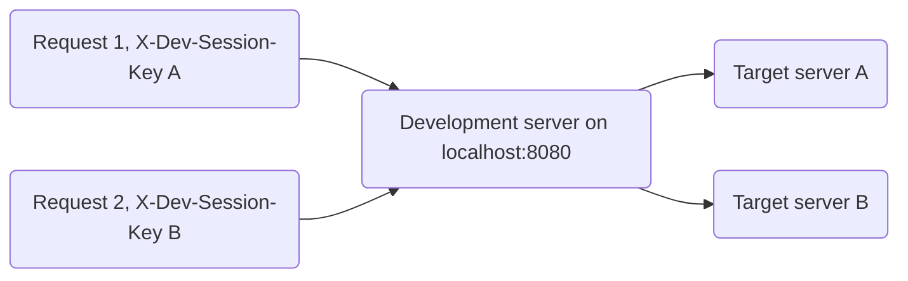

# HTTP Server Reference

Inox's HTTP server provides several high-level features and is **secure by
default**.

**WORK IN PROGRESS**

- [Creation](#creation)
- [Listening Address](#listening-address)
- [Certificate](#certificate)
- [Configuration object](#configuration-object)
- [Filesystem routing](#filesystem-routing)
- [Handler function](#handler-function)
- [Mapping handler](#mapping-handler)
- [Request handling](#request-handling)
- [Handler module](#handler-module)
- [Content Security Policy](#content-security-policy)
- [Development servers](#development-servers)

---

## Creation

The builtin `http.Server` function creates a listening HTTP**S** server.\
The first parameter is the [listening address](#listening-address): it should be
an HTTPS host such as `https://localhost:8080` or `https://0.0.0.0:8080`.

```
server = http.Server!(https://localhost:8080)
```

The second parameter is a handler ([function](#handler-function) or
[mapping](#mapping-based-routing)), or a
[configuration object](#configuration-object).

---

## Listening Address

The listening address is a Inox HTTPS host such as `https://localhost:8080` or
`https://0.0.0.0:8080`.

- If the host is `0.0.0.0` the server will listen on all public interfaces. ⚠️ If
  the [inox daemon](./inox-daemon.md) does not allow exposing web servers the
  server will listen on `localhost` as a fallback.

- In each development environment and test run an HTTP Server is able to listen
  to `localhost:8080`. This is possible because HTTP servers never really bind
  to 'development ports'. (See [Development servers](#development-servers)).

- The global constant `APP_LISTENING_ADDR` is equal to `https://localhost:8080`
  in development environments and in tests.

---

## Certificate

Inox's HTTP server automatically generates a self-signed certificate for
`localhost` and public IPs.

---

## Configuration Object

```
{
    routing: function | Mapping | {
        static?: <dir>
        dynamic?: <dir>
    }

    certificate?: <string>

    key?: <secret> # certificate's key

    default-csp?: http.CSP{ ....... }

    sessions?: {
        collection: <Set>
    }

    default-limits?: ...

    max-limits?: ...
}
```

---

## Filesystem Routing

```
server = http.Server!(https://localhost:8080, {
    routing: {
        # directory for static resources such as CSS and JS files.
        static: /static/

        # directory containing handler modules (Inox files).
        dynamic: /routes/
    }
})
```

When the server receives a request it determines what is the handler module
(file) for the request, and invokes the handler. The routing rules are the
following:

| Request's path | HTTP method | Possible handler paths                                        |
| -------------- | ----------- | ------------------------------------------------------------- |
| `/`            | `GET`       | `/GET-index.ix , /index.ix`                                   |
| `/about`       | `GET`       | `/GET-about.ix , /about.ix , /about/GET.ix , /about/index.ix` |
| `/users`       | `POST`      | `/POST-users.ix , /users/POST.ix , /users.ix`                 |
| `/users/0`     | `POST`      | `/users/:user-id/GET.ix , /users/:user-id/index.ix`           |

A **single handler module** should be defined for each endpoint/METHOD pair. The
`http.Server` function panics if there are two or more handlers for the same
endpoint/METHOD pair.

---

### Context Data

The filesystem router adds a context data entry for each **path parameter**. The
**key** of the entry is `/path-params/<parameter name>`.

Let's say that we have the following filesystem structure:

```
routes/
    users/
        :user-id/
            GET.ix
```

If a request of path `/users/123` is received the `GET.ix` handler module will
be invoked. The call to `ctx_data(/path-params/user-id)` will return the string
`123`.

---

## Handler Function

**WORK IN PROGRESS**

```
fn handle(response-writer http.resp-writer, request http.req){
    match request.path {
        / {
            response-writer.write_html("<!DOCTYPE html><html>..</html>)
        }
    }
}

http.Server(ADDR, handle)
```

---

## Mapping Handler

**WORK IN PROGRESS**

A **Mapping** handler can be used to handle simple requests or route requests.

```
fn handle(response-writer http.resp-writer, request http.req){
  ...
}

server = http.Server!(ADDR, Mapping {
    /hello => "hello"
    %/... => handle
})
```

---

## Request Handling

### 1. Pre-Validation

The pre-validation step perform several simple basic checks on the request. If
the pre-validation fails a response with a `404` status (Bad Request) is sent.

- The method should be a valid HTTP method (GET, POST, ...).
- A `Content-Type` header should be present for HTTP methods with a body.
- The path should not contain `..` segments, that includes `/../` and `\..\`

### 2. Rate Limiting

The server's security engine determines if the request should be rate limited.
Rate limited requests receive a response with a `429` status code.

### 3. State and Transaction Creation

A state is created for the handler. A **transaction** is also created if the
request does not accept a response of type `text/event-stream`. The transaction
times out after `20s` by default.

### 4. Routing

This step depends on the routing method:

- [Filesystem routing](#filesystem-routing)
- [Mapping handler](#mapping-handler)
- Manual routing if the handler is a [function](#handler-function)

### 5. Handler Invocation

The handler is invoked, it can be a **function**, a **Mapping** or a **module**.

- Handler functions are executed using the state created at
  [step 3](#3-routing).
- Mapping computations and nested handlers are executed with the state created
  at [step 3](#3-routing).
- The handler module selected by the **filesystem router** is executed using a
  state created by **preparing** the module. It is a child of the state at
  [step 3](#3-routing).

---

## Handler Module

---

## Content Security Policy

The default
[Content Security Policy]((https://developer.mozilla.org/en-US/docs/Web/HTTP/CSP).)
used by the HTTP server is the following:

- `default-src 'none';`
- `frame-ancestors 'none';`
- `frame-src 'none';`
- `script-src-elem 'self' 'nonce-[page-nonce]>';`
- `connect-src 'self';`
- `font-src 'self';`
- `img-src 'self';`
- `style-src-elem 'self' 'unsafe-inline';`.

Directives can be **individually** overriden or added by passing a CSP to the
server:

```
server = http.Server!(APP_LISTENING_ADDR {
    ...
    default-csp: http.CSP{
        # allow loading images from any HTTPS website.
        img-src: "https://*"
    
        # allow loading scripts from the current server and unpkg.com.
        script-src-elem: "'self' https://unpkg.com/" 
    }
    ...
})
```

### Page Nonce

If the filesystem router is used, a nonce is **always added** to the
`script-src-elem` directive and to all `<script>` elements in the page's HTML.

---

## Development Servers

A development server is an HTTP server that binds to `localhost:8080` (or
`localhost:8081`). HTTP servers in development environments (and test runs) that
are configured to listen on localhost:8080 do not bind to anything. Instead each
server informs the corresponding **development server** that it is the target
server for requests with a specific value for the header `X-Dev-Session-Key`.
Each development environment has its own development session key.


