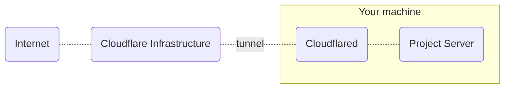

# Inox Daemon (inoxd)

**Inoxd** creates and manages one or more project server processes (command `inox project-server`).\
Inoxd can be installed on any Linux distribution that uses **systemd**.

## Installation A - Inoxd + Publicly Exposed Servers

The command below will add a new systemd service and create a new user named `inoxd`.\
The `--expose-project-servers` flag makes project servers listen on ⚠️ ALL interfaces.\
The `--expose-web-servers` flag makes web (application) servers listen on ⚠️ ALL interfaces.

```
sudo inox add-service --expose-project-servers --expose-web-servers
```

**This installation is not recommended for production environments.**

## Installation B - Inoxd + Cloudflare Tunnel

The following command will add a new systemd service, create a new user named `inoxd` and download the latest [Cloudflared](https://github.com/cloudflare/cloudflared) binary. 

```
sudo inox add-service --tunnel-provider=cloudflare
```

