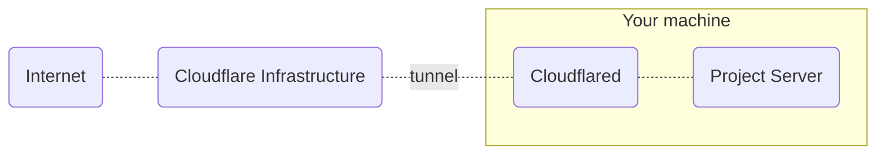

# Inox Daemon (inoxd)

**Inoxd** creates and manages one or more project server processes (command `inox project-server`).\
Inoxd can be installed on any Linux distribution that uses **systemd**.

# Installation A - Inoxd

The following command will add a new systemd service and create a new user named `inoxd`.
You will have to expose the project server listening on localhost (port 8305 by default) yourself.
If you don't want to do that you can perform the **Installation B** instead.

```
inox add-service
```

# Installation B - Inoxd + Cloudflared

The following command will add a new systemd service, create a new user named `inoxd` and download the latest [Cloudflared](https://github.com/cloudflare/cloudflared) binary. 

```
inox add-service --tunnel-provider=cloudflare
```



