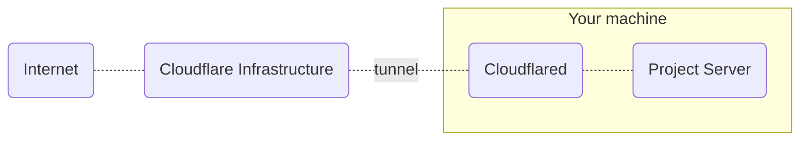

# Inox Daemon (inoxd)

**Inoxd** creates and manages one or more project server processes (command `inox project-server`).\
Inoxd can be installed on any Linux distribution that uses **systemd**.

- The project server listens on the port 8305 by default
- Data of production* deployments is stored in `/var/lib/inoxd/prod`
- Projects are stored in `/var/lib/inoxd/projects`

_\* bear in mind that Inox is not production ready yet._

## Installation

### On Your Local Machine

The command below adds a new systemd service and create a new user named `inoxd`.
The project server will only listen on `localhost:8305`.

```
sudo inox add-service
```

Browser automation can be allowed by adding the `--allow-browser-automation` switch.

### On a VPS - Publicly Exposed Servers

The command below adds a new systemd service and creates a new user named `inoxd`.\
The `--expose-project-servers` flag makes project servers listen on ⚠️ ALL interfaces.\
The `--expose-web-servers` flag makes web (application) servers listen on ⚠️ ALL interfaces.

```
sudo inox add-service --expose-project-servers --expose-web-servers
```

Browser automation can be allowed by adding the `--allow-browser-automation` switch.

**This installation is not recommended for production environments.**

### On a VPS - Cloudflare Tunnel 

A Cloudflare account is required.
> For now this installation also requires that you create and configure a Cloudflare tunnel yourself.

The following command adds a new systemd service, creates a new user named `inoxd` and downloads the latest [Cloudflared](https://github.com/cloudflare/cloudflared) binary. 

```
sudo inox add-service --tunnel-provider=cloudflare
```



Browser automation can be allowed by adding the `--allow-browser-automation` switch.

## Implementation

[Project Server](../internal/project_server/README.md)