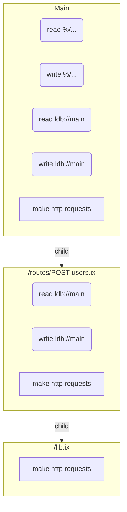

# Permissions

Permissions represent a type of action a module is allowed (or forbidden) to do.
Most IO operations (filesystem access, HTTP requests) and resource intensive
operations (lthread creation) necessitate a permission.

The [context](./context.md) of each module instance contains the granted and forbidden permissions.
The permissions granted to a module instance are defined in the [permissions section](./modules.md#permissions) of its manifest.



The permission set of a descendant module is always a **subset** of its parent's permissions.

## Permissions Section

The `permissions` section of the manifest lists the permissions required by the
module. Permissions represent a type of action a module is allowed (or
forbidden) to do. Most IO operations (filesystem access, HTTP requests) and
resource intensive operations (lthread creation) necessitate a permission.

**Examples:**

```
# reading any file in /home/user/ or below
manifest {
    permissions: {
        read: {
            %/home/user/...
        }
    }
}

# sending HTTP GET & POST requests to any HTTPS server
manifest {
    permissions: {
        read: {
            %https://**
        }
        write: {
            %https://**
        }
    }
}

# creating an HTTPS server listening on localhost:8080
manifest {
    permissions: {
        provide: https://localhost:808
    }
}

# reading from & writing to the database ldb://main
manifest {
    permissions: {
        read: {
            ldb://main
        }
        write: {
            ldb://main
        }
    }
}

# creating lightweight threads
manifest {
    permissions: {
        create: {
            threads: {}
        }
    }
}
```

## Permission Dropping

Sometimes programs have an **initialization** phase, for example a program reads
a file or performs an HTTP request to fetch its configuration. After this phase
it no longer needs some permissions so it can drop them.

```
drop-perms {
  read: %https://**
}
```