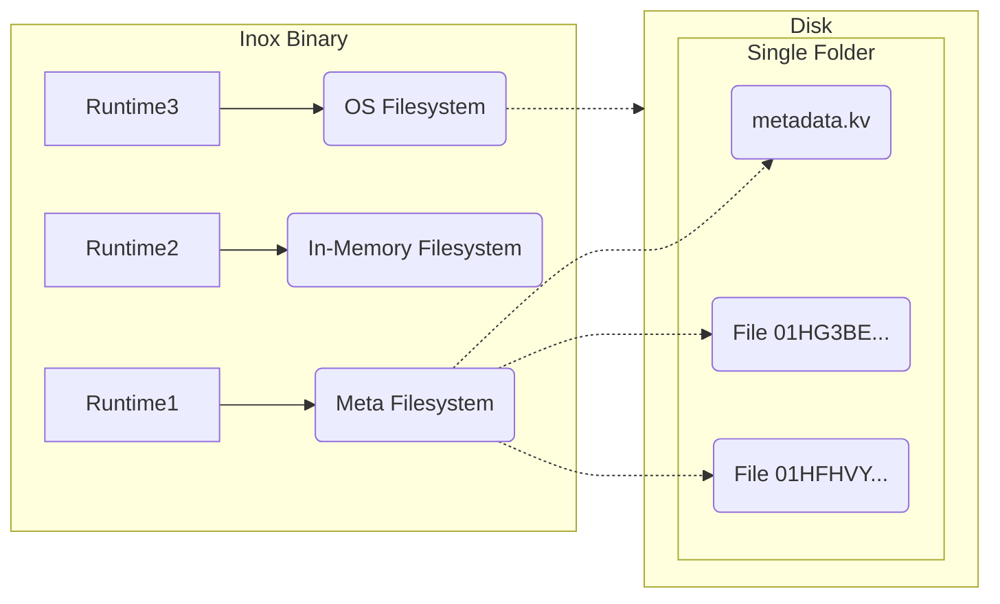

# Virtual Filesystem

In project mode, Inox applications run inside a virtual filesystem named a **meta filesystem** that persists data on disk.
Files in this filesystem are regular files, (most) metadata and directory structure are stored in a single file named `metadata.kv`.
It's impossible for applications running inside this filesystem to access an arbitrary file on the disk.

Inox also supports in-memory filesystems.

