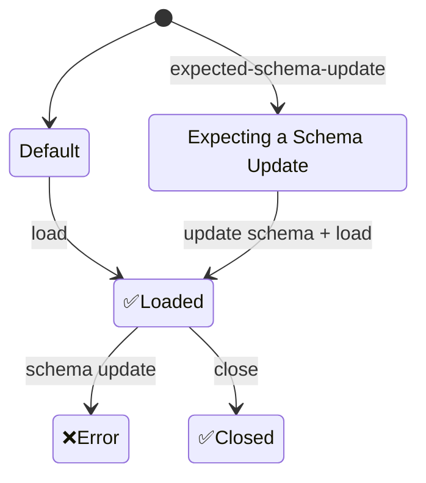

# Database

### Database State

In database definitions the property `expected-schema-update` should be set to true
to indicate that a schema update is expected and **must** happen.
If an unexpected schema update happens an error is thrown.

```
manifest {
    ...
    databases: {
        main: {
            resource: ldb://main
            resolution-data: nil
            expected-schema-update: true
        }
    }
    ...
}
```



## Entities

<!--keep in sync with docs/language reference-->

**Entities** are model objects that have a URL.
Let's see an example: we have a local database named `main` with the following schema:

```
users Set(user, #url)
```

- The `/users` container (Set) is an entity and its URL is `ldb://main/users`
- The elements of the container are entities because the container assigns a URL to each of them.
  The URL of an element follows the following format: `ldb://main/users/<an ID>`.

## Updates

Like all Inox values entities can be modified.

### Self-Managed Entity

A **self-managed** entity is responsible for persisting value changes made by business logic.
Such entities are considered **free** when they are not inside a container.

### Container-Managed Entity

A **container-managed** entity is not responsible for persisting value changes, this is performed by its container instead.
Note that containers can contain self-managed entities.