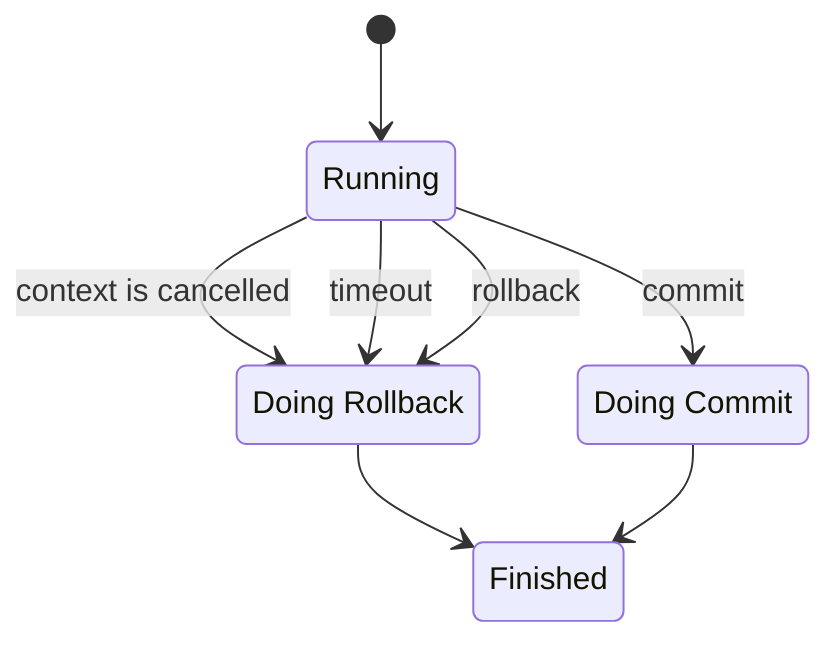

# Core

This package contains most the code for the Inox Runtime, the type checking logic is in the **symbolic/** package.

 
**
Code organization
**

The code evaluation tests are the same for the bytecode interpreter and the tree walk evaluation,
they are located in [eval_test.go](eval_test.go).

- Tree Walk Evaluation
    - [tree_walk_state.go](tree_walk_state.go)
    - [tree_walk_eval.go](tree_walk_eval.go)
    - [tree_walk_eval_call.go](tree_walk_eval_call.go)
- Bytecode Interpreter (inspired from https://github.com/d5/tengo.)
    - [compiler.go](compiler.go)
    - [vm.go](vm.go)
- Static Check
    - [static_check.go](static_check.go)
- Symbolic Evaluation and Typechecking
    - [symbolic.go](symbolic.go)
    - [symbolic package](./symbolic/)
- Core Value Types
    - [value.go](value.go)
    - [number.go](number.go)
    - [quantity.go](quantity.go)
    - [immutable_data_structures.go](immutable_data_structures.go)
    - [object.go](./object.go)
    - [dictionary.go](./dictionary.go)
    - [indexable.go](./indexable.go)
    - [mapping.go](./mapping.go)
- Core Pattern Types
    - [pattern.go](pattern.go)
    - [string_pattern.go](string_pattern.go)
- Module
    - [module.go](module.go)
    - [module_import.go](module_import.go)
    - [preinit.go](preinit.go)
    - [manifest.go](manifest.go)
- Context & Security
    - [context.go](context.go)
    - [permissions.go](permissions.go)
    - [limit.go](limit.go)
    - [token_bucket.go](token_bucket.go)
- Transaction
    - [transaction.go](./transaction.go)
    - [transaction_isolation.go](./transaction_isolation.go)
- Secrets
    - [secrets.go](secrets.go)
- Mutation
    - [mutation.go](mutation.go)
    - [watcher.go](watcher.go)
- Database
    - [database.go](database.go)
- Debugger
    - [debug.go](debug.go)
    - [debug_types.go](debug_types.go)
- Testing
    - [testing.go](testing.go)
- Serialization / Deserialization
    - [write_representation.go](write_representation.go)
    - [write_json_representation.go](write_json_representation.go)
    - [parse_representation.go](parse_representation.go)
    - [parse_json_representation.go](parse_json_representation.go)
    - [json_schema.go](json_schema.go)

- ⚙️ [Runtime Architecture](./RUNTIME.md) 
- 💾 [Database](./DATABASE.md) 

## Module Preparation

Module preparation is implemented in [module_preparation.go](./module_preparation.go), it consists of several steps:
- Parsing
- Pre-initialization
- Context Creation
- Global State Creation
- Database Openings
- Retrieval of Project Secrets
- Static Checks
- Symbolic Evaluation (typechecking)

*Note that module preparation is not used by [module imports](../../docs/language-reference/README.md#module-imports).*

### Parsing

Recursive parsing of the module and its imports.

### Pre-initialization

The pre-initialization is the checking and creation of the module's manifest.

1.  the pre-init block is statically checked (if present).
2.  the manifest's object literal is statically checked.
3.  pre-evaluate the env section of the manifest.
4.  pre-evaluate the preinit-files section of the manifest.
5.  read & parse the preinit-files using the provided .PreinitFilesystem.
6.  evaluate & define the global constants (const ....).
7.  evaluate the preinit block.
8.  evaluate the manifest's object literal.
9.  create the manifest.

### Context Creation

A context containing all the core pattern types (int, str, ...) is created.
The most relevant inputs are:
- the permissions listed in the manifest
- the limits listed in the manifest
- the host definition data specified in the manifest
- the **parent context** (host definition data and limits are inherited)

### Global State Creation

[implementation](../globals/default_state.go)

The global state of the module is created and is initialized
with the default globals (variables, functions & namespaces).

### Database Openings

Databases described in the manifest or created if necessary and opened.

### Retrieval of Project Secrets

If a project has been passed its secrets are retrieved and the global `project-secrets` is added to the state.

### Static Checks

During this phase the code is analyzed in order to find the following issues:
- misplaced statements
- undeclared variables or patterns
- duplicate declarations

*(and a few others)*

### Symbolic Evaluation

The symbolic evaluation of a module is a "virtual" evaluation, it performs checks similar to those of a type checker.
Throughout the Inox documentation you may encounter the terms "type checker"/ "type checking", they correspond to the 
symbolic evaluation phase.

## Transactions

**Simplified State Diagram**

