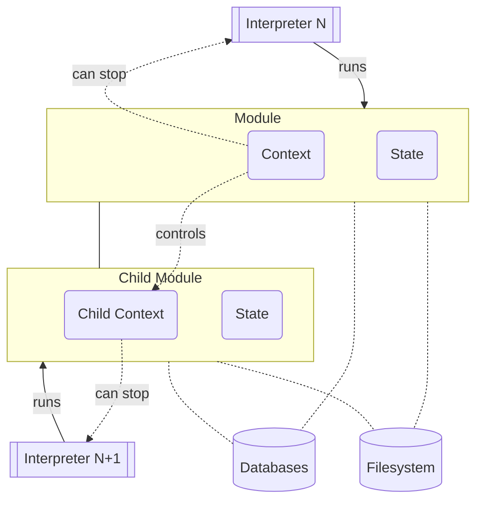
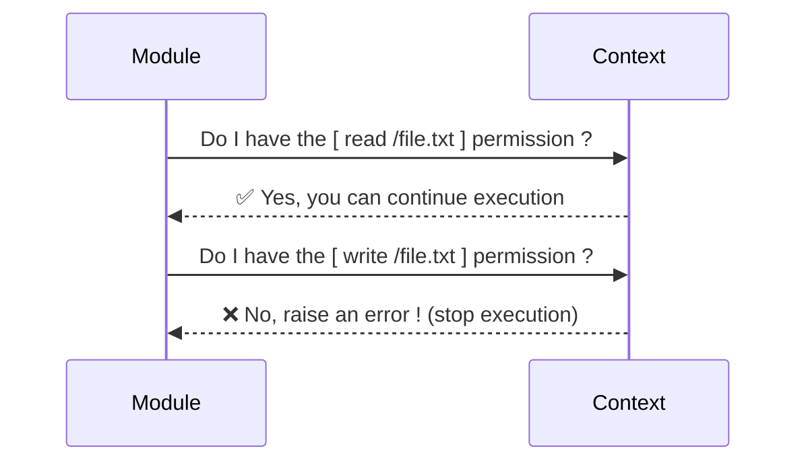
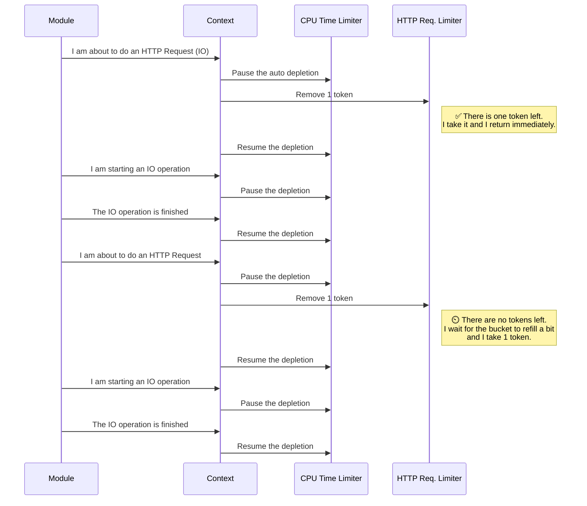
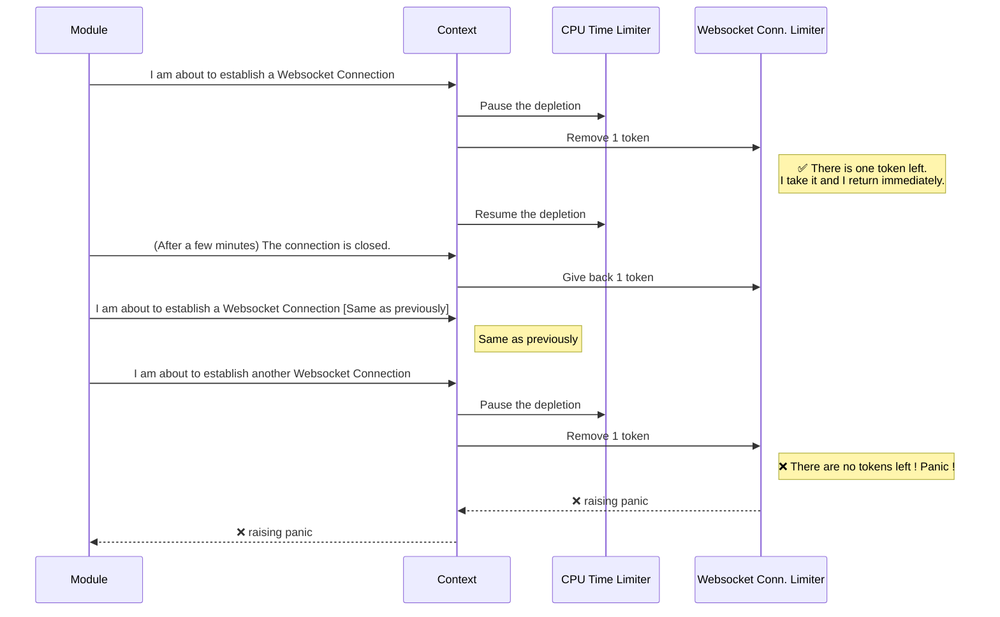
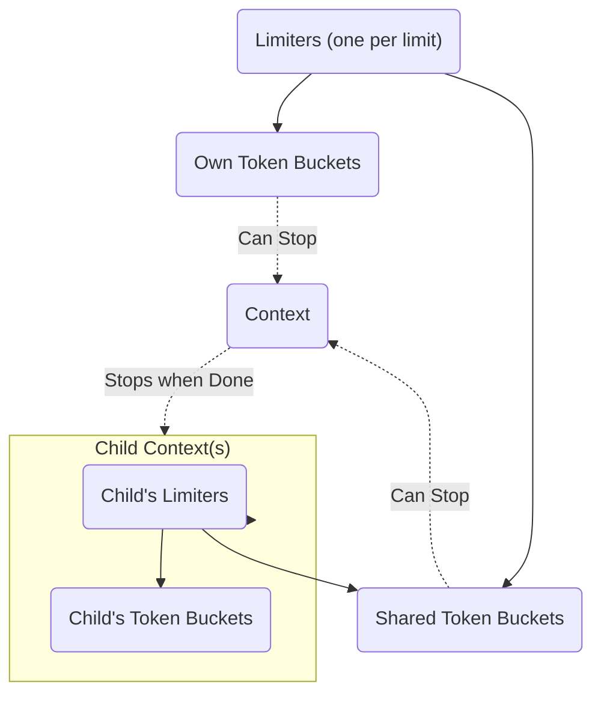
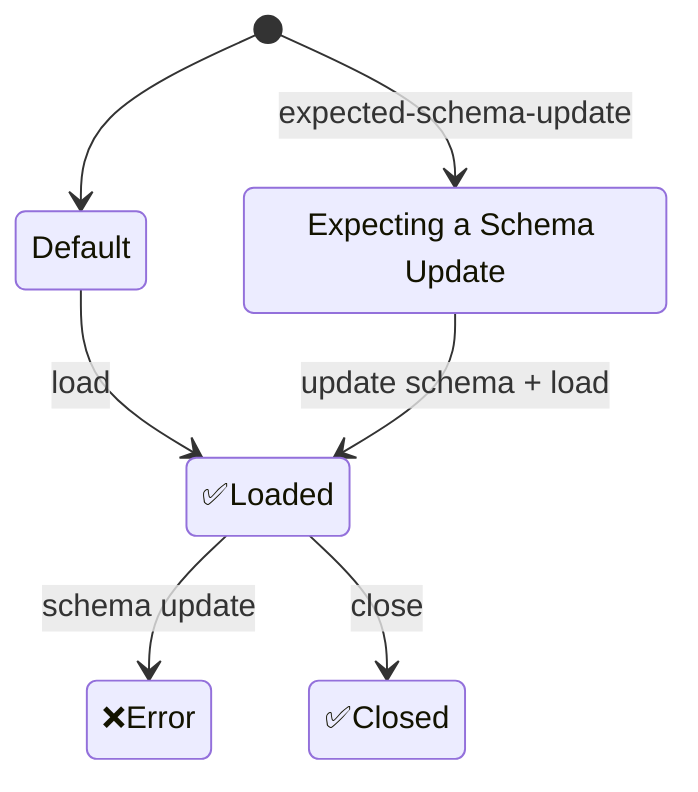
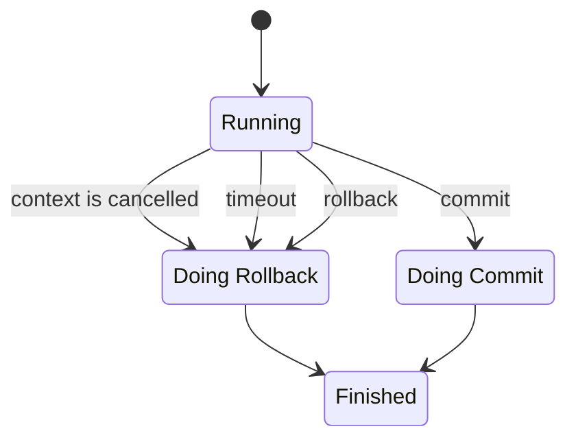

# Core

This package contains most the code for the Inox Runtime, the type checking logic is in the **symbolic/** package.


<details>
<summary>Code organization</summary>

- Tree Walk Interpreter
    - [tree_walk.go](tree_walk.go)
- Bytecode Interpreter (inspired from https://github.com/d5/tengo.)
    - [compiler.go](compiler.go)
    - [vm.go](vm.go)
- Static Check
    - [static_check.go](static_check.go)
- Symbolic Evaluation and Typechecking
    - [symbolic.go](symbolic.go)
    - [symbolic package](./symbolic/)
- Core Value Types
    - [value.go](value.go)
    - [number.go](number.go)
    - [quantity.go](quantity.go)
    - [mutable_data_structures.go](mutable_data_structures.go)
    - [immutable_data_structures.go](immutable_data_structures.go)
- Core Pattern Types
    - [pattern.go](pattern.go)
    - [string_pattern.go](string_pattern.go)
- Module
    - [module.go](module.go)
    - [module_import.go](module_import.go)
    - [preinit.go](preinit.go)
    - [manifest.go](manifest.go)
- Context & Security
    - [context.go](context.go)
    - [permissions.go](permissions.go)
    - [limit.go](limit.go)
    - [token_bucket.go](token_bucket.go)
- Secrets
    - [secrets.go](secrets.go)
- Mutation
    - [mutation.go](mutation.go)
    - [watcher.go](watcher.go)
- Database
    - [database.go](database.go)
- Debugger
    - [debug.go](debug.go)
    - [debug_types.go](debug_types.go)
- Testing
    - [testing.go](testing.go)
- Serialization / Deserialization
    - [write_representation.go](write_representation.go)
    - [write_json_representation.go](write_json_representation.go)
    - [parse_representation.go](parse_representation.go)
    - [parse_json_representation.go](parse_json_representation.go)
    - [json_schema.go](json_schema.go)
</details>

## Module Preparation

Module preparation is implemented in [module_preparation.go](./module_preparation.go), it consists of several steps:
- Parsing
- Pre-initialization
- Context Creation
- Global State Creation
- Database Openings
- Retrieval of Project Secrets
- Static Checks
- Symbolic Evaluation (typechecking)

*Note that module preparation is not used by [module imports](../../docs/language-reference.md#module-imports).*

### Parsing

Recursive parsing of the module and its imports.

### Pre-initialization

The pre-initialization is the checking and creation of the module's manifest.

1.  the pre-init block is statically checked (if present).
2.  the manifest's object literal is statically checked.
3.  pre-evaluate the env section of the manifest.
4.  pre-evaluate the preinit-files section of the manifest.
5.  read & parse the preinit-files using the provided .PreinitFilesystem.
6.  evaluate & define the global constants (const ....).
7.  evaluate the preinit block.
8.  evaluate the manifest's object literal.
9.  create the manifest.

### Context Creation

A context containing all the core pattern types (int, str, ...) is created.
The most relevant inputs are:
- the permissions listed in the manifest
- the limits listed in the manifest
- the host resolution data specified in the manifest
- the **parent context** (host resolution data and limits are inherited)

### Global State Creation

[implementation](../globals/default_state.go)

The global state of the module is created and is initialized
with the default globals (variables, functions & namespaces).

### Database Openings

Databases described in the manifest or created if necessary and opened.

### Retrieval of Project Secrets

If a project has been passed its secrets are retrieved and the global `project-secrets` is added to the state.

### Static Checks

During this phase the code is analyzed in order to find the following issues:
- misplaced statements
- undeclared variables or patterns
- duplicate declarations

*(and a few others)*

### Symbolic Evaluation

The symbolic evaluation of a module is a "virtual" evaluation, it performs checks similar to those of a type checker.
Throughout the Inox documentation you may encounter the terms "type checker"/ "type checking", they correspond to the 
symbolic evaluation phase.


## Inox Runtime Architecture

### High Level View

Each Inox module is executed by a dedicated [interpreter](./docs/language-reference.md#evaluation).



### Global State

Each module instance has its own **global state** that contains:
- global variables.
- the module instance's manifest (immutable).
- the module instances's [context](./#context).
- databases accessible by the module instance.
- a reference to the project the module is part of.
- a reference to the module definition (immutable).

### Context

Each module instance has its own context.\
A context is analogous to a `context.Context` in Golang's stdlib: 
when the context is cancelled all descendant contexts are cancelled as well.
The cancellation of a module instance's context causes the interpreter to stop.

#### Creation

Most relevant inputs come from the module's manifest:
- list of permissions required by the module.
- list of limits specified by the module.
- list of database configurations specified by the module (owned databases).
- host definitions (resolution data) specified by the module.

Another relevant input is the parent context. In most cases a context have a parent context; 
when a context has a parent additional checks are performed:
- all permissions required by the module should be also granted to the parent.
- limits specified by the module must be as or more restrictive than the parent context's limits.
- no host definition should override a host defined by the parent's context.

Hosts defined by the parent context and limits are inherited.
If no filesystem is present in the creation arguments the child context gets its parent's filesystem.

#### Sequence Diagram for Permission Checks



#### Sequence Diagram for Rate Limiting




#### Sequence Diagram for Total Limiting



<details>
<summary>Note</summary>
Obviously the context knowns nothing about HTTP requests, Websocket Connections and all other types of IO operations.

The module informs the context with a simple call:
```
context.Take(<simultaneous websocket connection limit>, 1 token)
```
</details>

**Limiters**




[Issues with the 'CPU time' limit](https://github.com/inoxlang/inox/issues/19).

## Database

**Database State Diagram**

In database definitions the property `expected-schema-update` should be set to true
to indicate that a schema update is expected and **must** happen.
If an unexpected schema update happens an error is thrown.

```
manifest {
    ...
    databases: {
        main: {
            resource: ldb://main
            resolution-data: /databases/main/
            expected-schema-update: true
        }
    }
    ...
}
```



## Transactions

**Simplified State Diagram**


