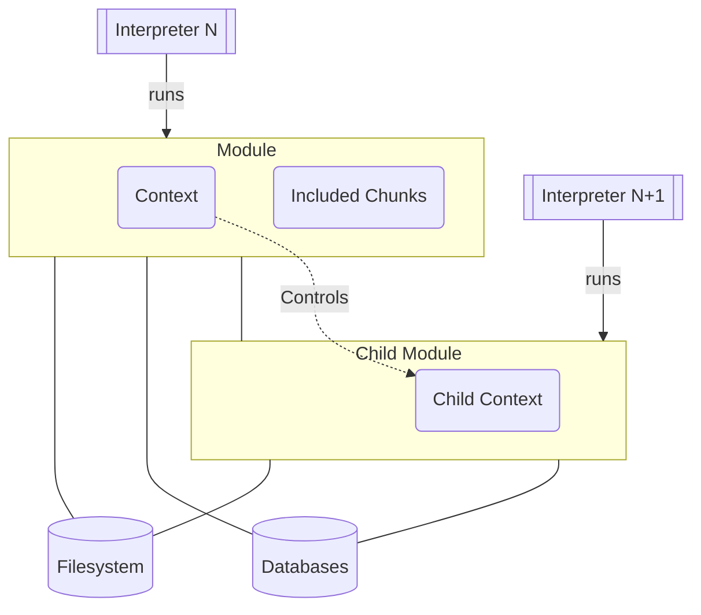
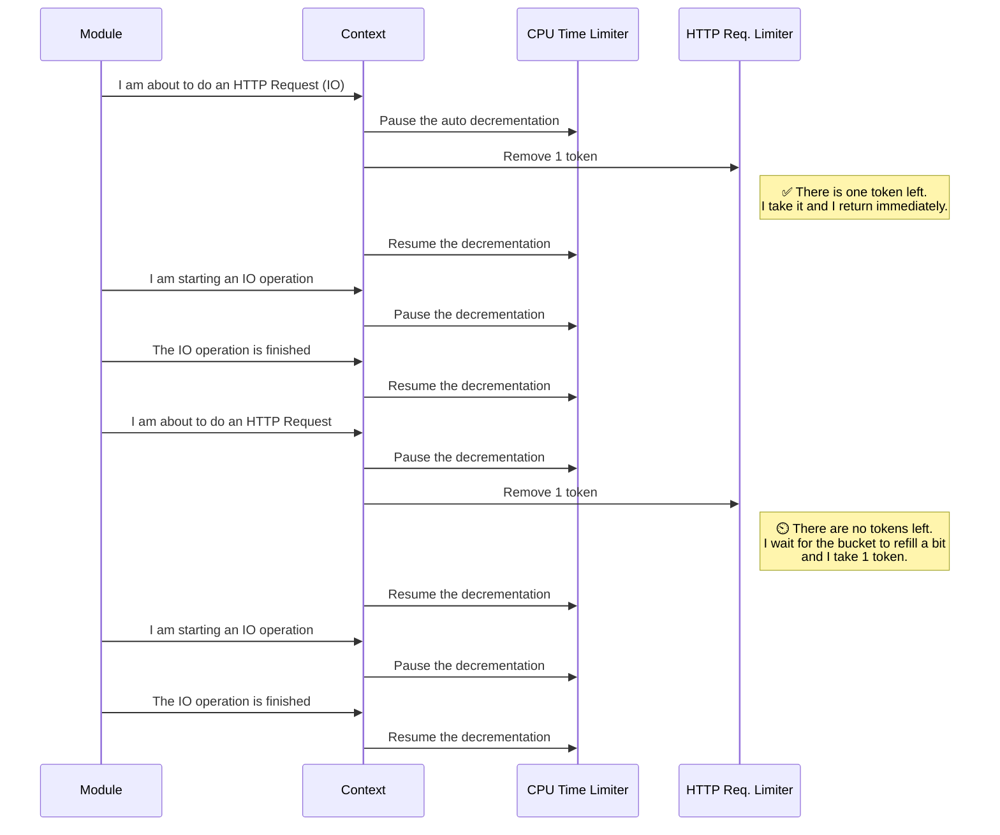
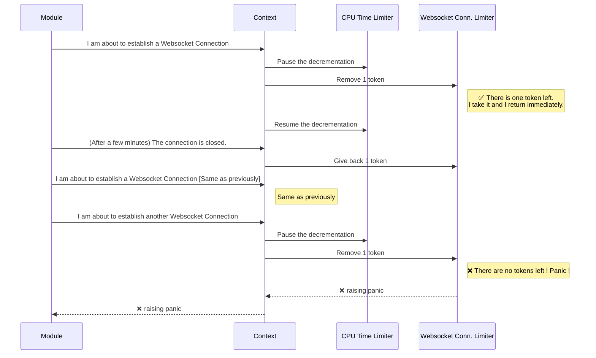

# Core

This package contains most the code for the Inox Runtime, the type checking logic is in the **symbolic/** package.

- Tree Walk Interpreter
    - **tree_walk.go**
- Bytecode Interpreter (inspired from https://github.com/d5/tengo.)
    - **compiler.go**
    - **vm.go**
- Static Check
    - **static_check.go**
- Core Value Types
    - **value.go**
    - **number.go**
    - **quantity.go**
    - **data_structure.go**
- Core Pattern Types
    - **pattern.go**
    - **string_pattern.go**
- Module
    - **module.go**
    - **module_import.go**
    - **manifest.go**
- Context & Security
    - **context.go**
    - **permissions.go**
    - **limit.go**
    - **token_bucket.go**
- Permissions
- Secrets
    - **secrets.go**
- Database
    - **database.go**
- Debugger
    - **debug.go**
    - **debug_types.go**
- Serialization / Deserialization
    - **write_representation.go**
    - **write_json_representation.go**
    - **parse_representation.go**
    - **parse_json_representation.go**
    - **json_schema.go**

## Inox Runtime Architecture

### High Level View

Each Inox module is executed by a dedicated [interpreter](./docs/language-reference.md#evaluation).



### Global State

Each module instance has itw own **global state**.
The global state holds the state of the module instance:
- global variables.
- the module instance's manifest (immutable).
- the module instances's [context](./#context).
- databases accessible by the module instance.
- a reference to the project the module is part of.
- a reference to the module definition (immutable).

### Context

Each module instance has its own context.\
A context is analogous to a `context.Context` in Golang's stdlib: 
when the context is cancelled all ancestor contexts are cancelled as well.

#### Creation

Most relevant inputs come from the module's manifest:
- list of permissions required by the module.
- list of limits specified by the module.
- list of database configurations specified by the module (owned databases).
- host definitions (resolution data) specified by the module.

Another relevant input is the parent context. In most cases a context have a parent context; 
when a context has a parent additional checks are performed:
- all permissions required by the module should be also granted to the parent.
- limits specified by the module must be as or more restrictive than the parent context's limits.
- no host definition should override a host defined by the parent's context.

Hosts defined by the parent context and limits are inherited.

#### Sequence Diagram for Permission Checks


#### Sequence Diagram for Rate Limiting




#### Sequence Diagram for Total Limiting



<details>
<summary>Note</summary>
Obviously the context knowns nothing about HTTP requests, Websocket Connections and all other IO operations.

The module informs the context with a simple call:
```
context.Take("<simultaneous websocket connection limit>", 1)
```
</details>

**Limiters**


