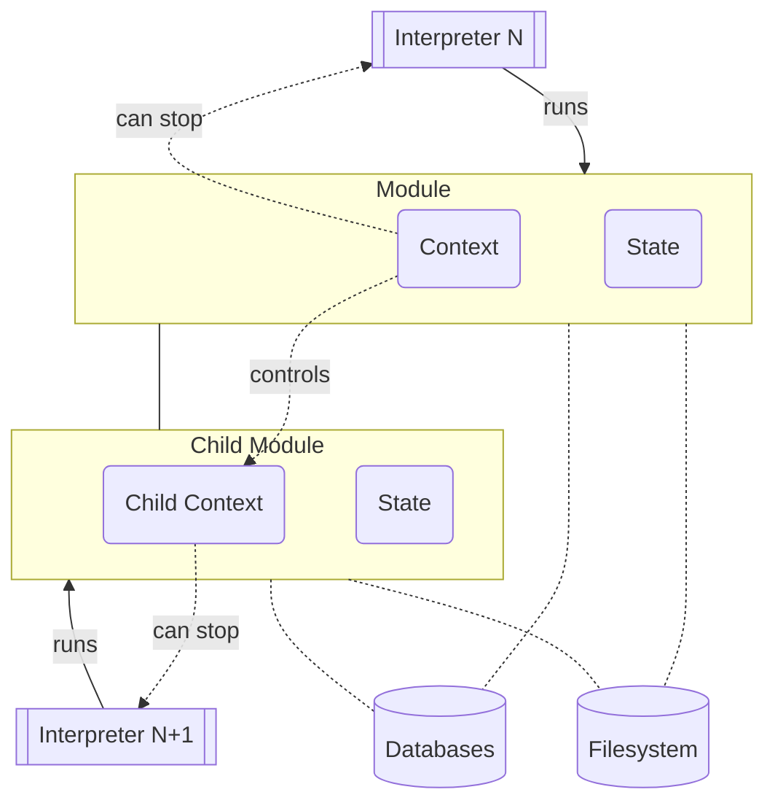
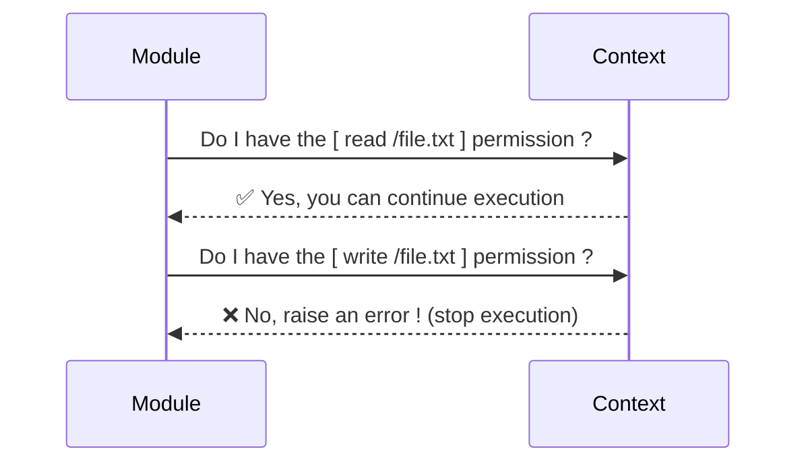
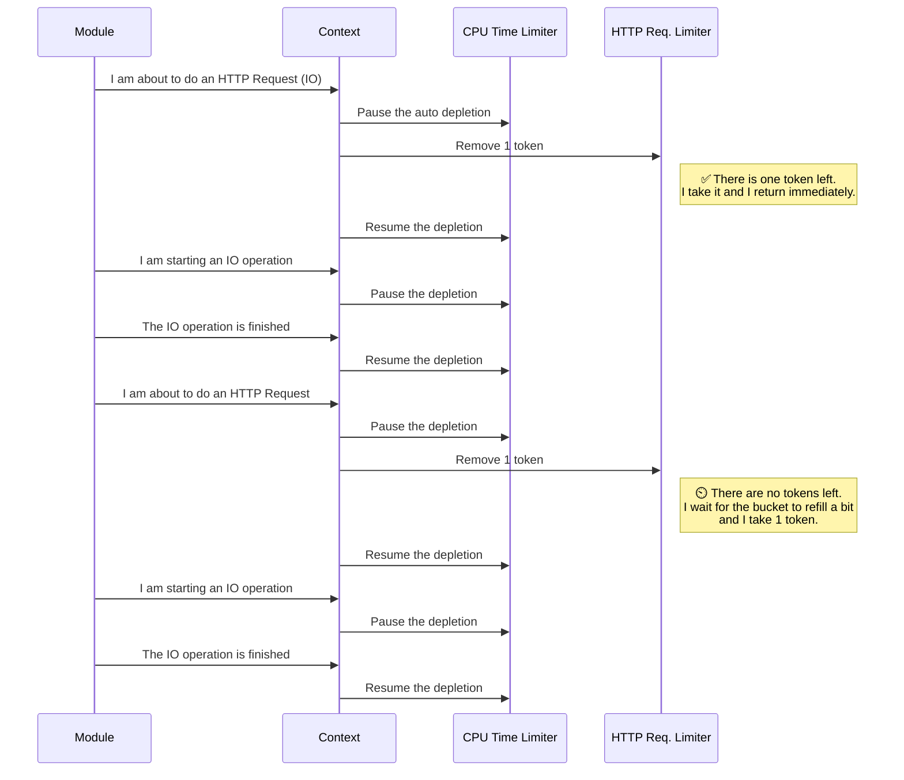
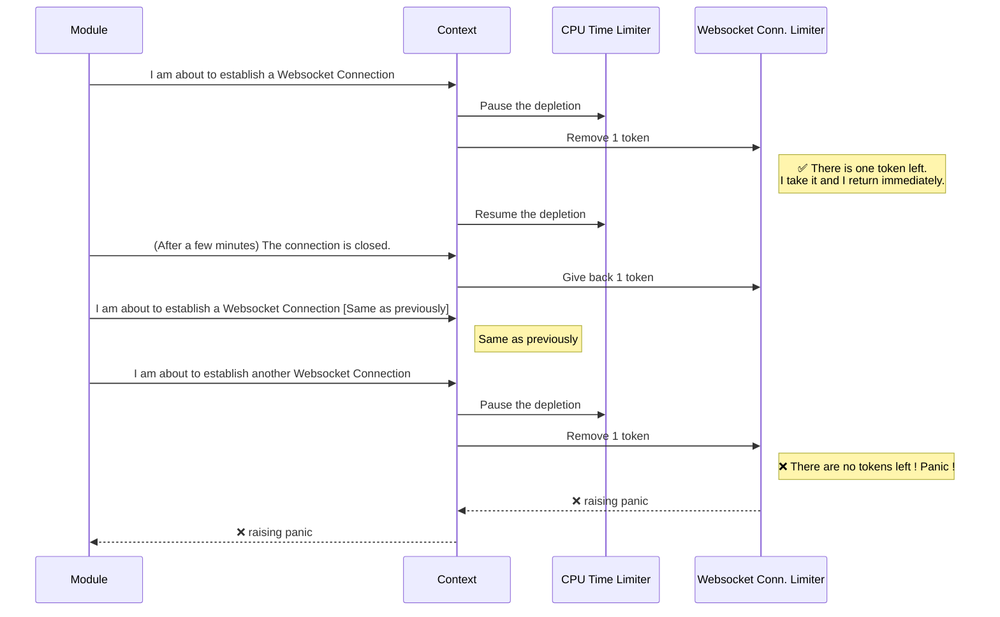
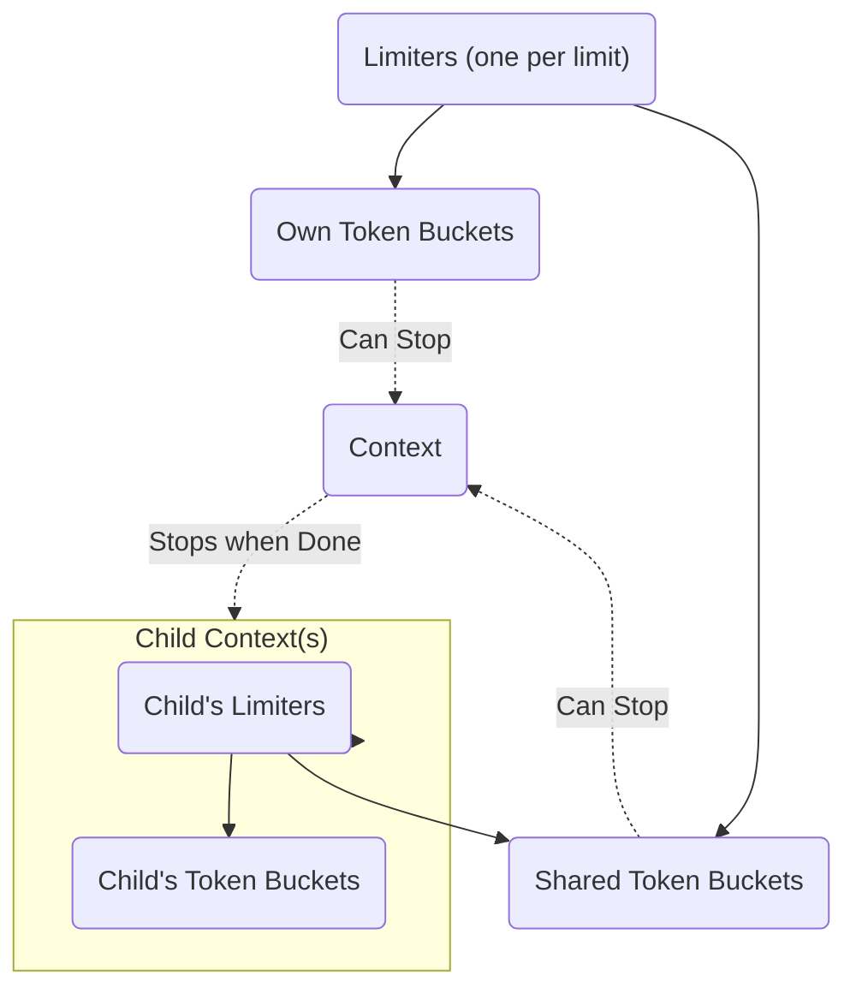

# Inox Runtime Architecture

## High Level View

Each Inox module is executed by a dedicated [interpreter](./docs/language-reference/README.md#evaluation).



## Global State

Each module instance has its own **global state** that contains:
- global variables.
- the module instance's manifest (immutable).
- the module instances's [context](./#context).
- databases accessible by the module instance.
- a reference to the project the module is part of.
- a reference to the module definition (immutable).

## Context

Each module instance has its own context.\
A context is analogous to a `context.Context` in Golang's stdlib: 
when the context is cancelled all descendant contexts are cancelled as well.
The cancellation of a module instance's context causes the interpreter to stop.

### Creation

Most relevant inputs come from the module's manifest:
- list of permissions required by the module.
- list of limits specified by the module.
- list of database configurations specified by the module (owned databases).
- host definitions (resolution data) specified by the module.

Another relevant input is the parent context. In most cases a context have a parent context; 
when a context has a parent additional checks are performed:
- all permissions required by the module should be also granted to the parent.
- limits specified by the module must be as or more restrictive than the parent context's limits.
- no host definition should override a host defined by the parent's context.

Hosts defined by the parent context and limits are inherited.
If no filesystem is present in the creation arguments the child context gets its parent's filesystem.

### Sequence Diagram for Permission Checks



### Sequence Diagram for Rate Limiting




### Sequence Diagram for Total Limiting



<details>
<summary>Note</summary>
Obviously the context knowns nothing about HTTP requests, Websocket Connections and all other types of IO operations.

The module informs the context with a simple call:
```
context.Take(<simultaneous websocket connection limit>, 1 token)
```
</details>

**Limiters**




[Issues with the 'CPU time' limit](https://github.com/inoxlang/inox/issues/19).
