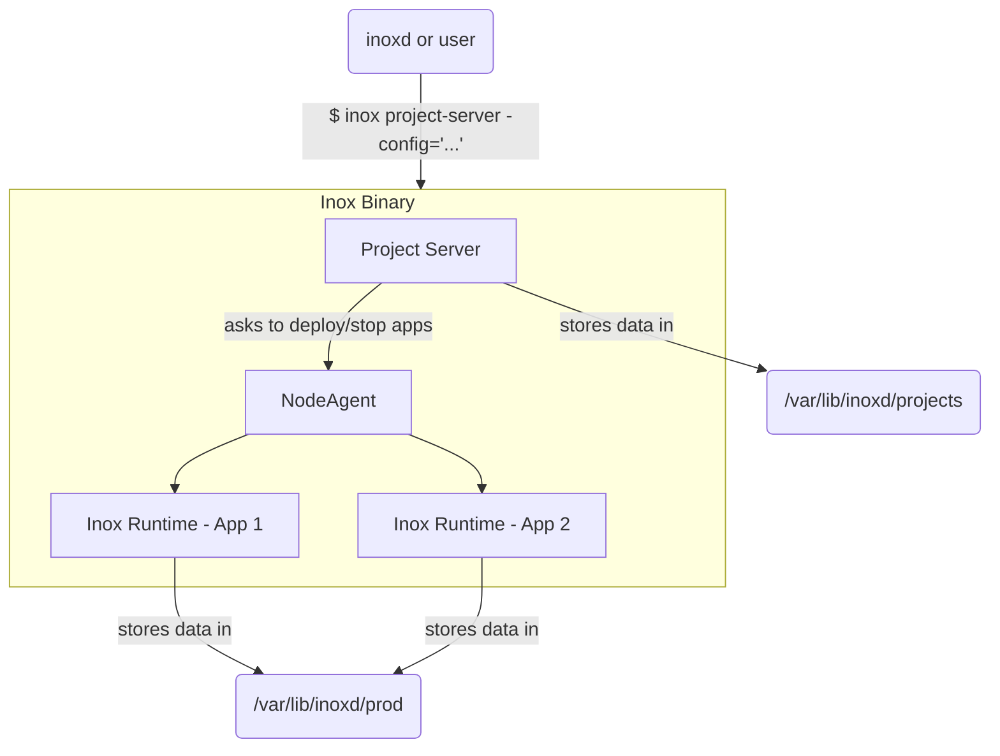
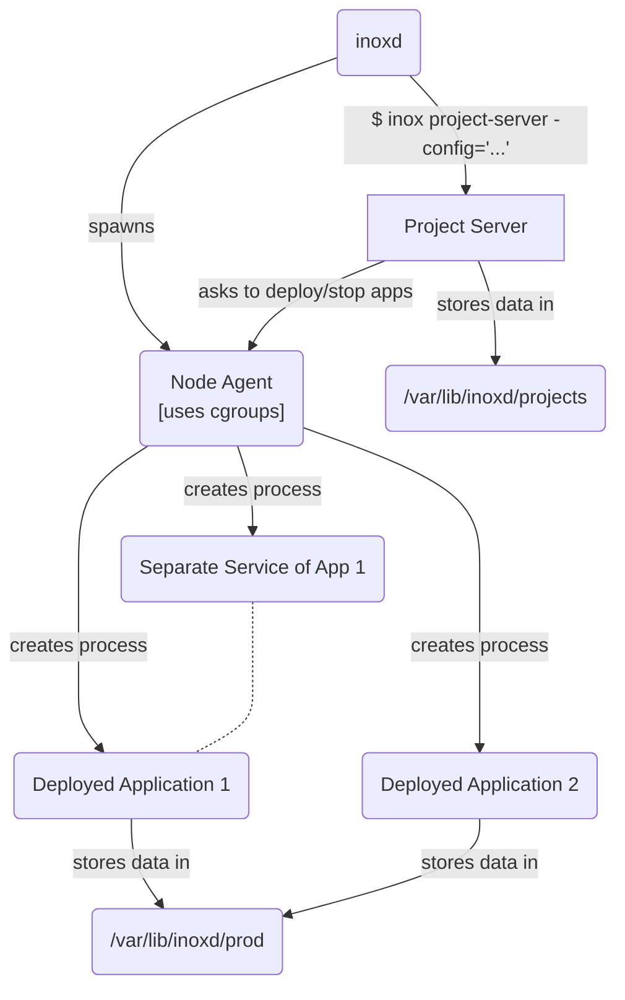

# Project Server Package

This package contains the code for the Inox Project Server.
The Project Server is basically an LSP server with extra features:
- Custom methods for [debugging](./debug_methods.go) (Debug Adapter Protocol)
- Custom methods for [accessing filesystems](./filesystem_methods.go)
- Custom methods for [accessing project secrets](./secrets_methods.go)
- Custom methods for [creating and opening projects](./project_methods.go)
- Custom methods for [production management](./prod_methods.go)
- Custom methods for [retrieving learning data](./learning_methods.go) (e.g. tutorials)

Subpackages:

- **jsonrpc**
- **logs**
- **lsp**: language-agnostic logic & types

## Architecture

### Current (temporary)

**The next version is way more secure and resilient.**

### Next

In this version every important component runs in a separate `inox` process.

_The next version may be slightly different from what is planned here._
